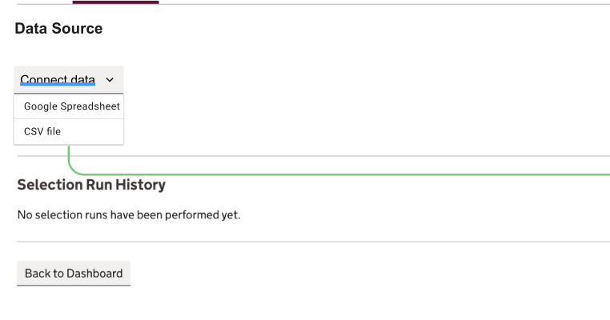
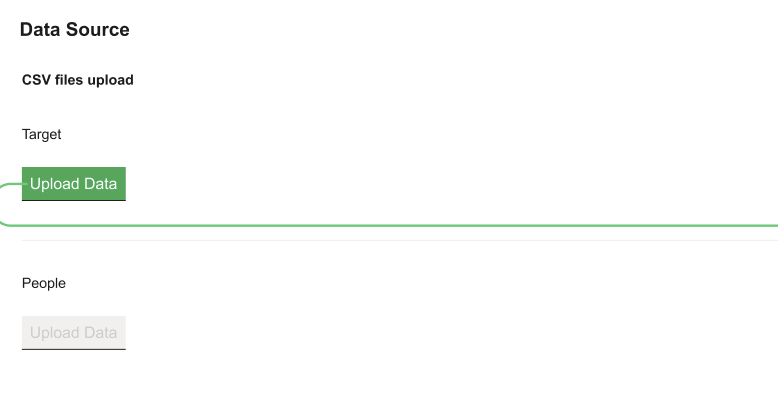
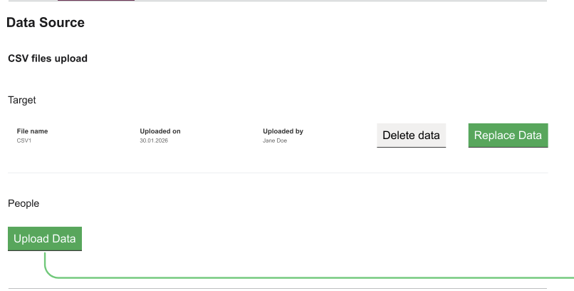
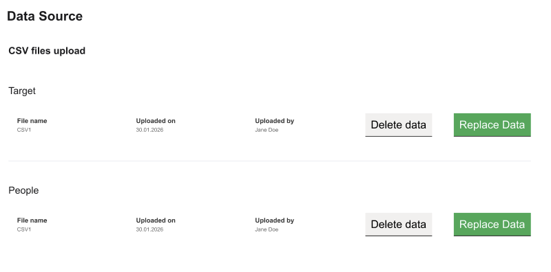
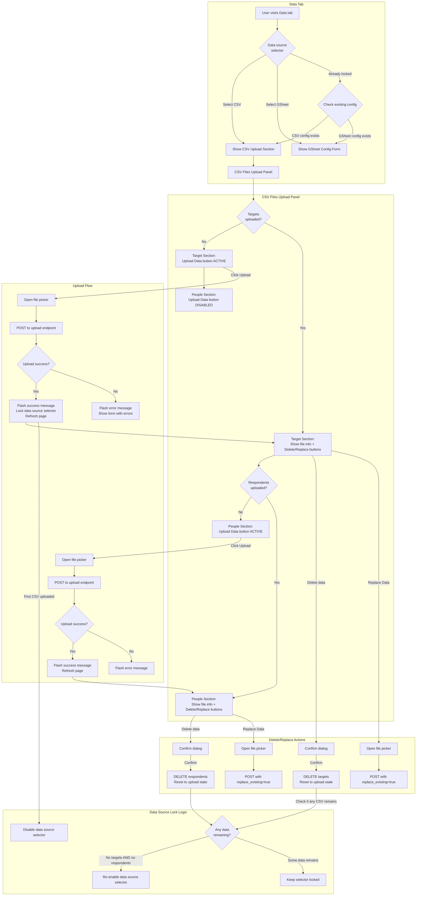
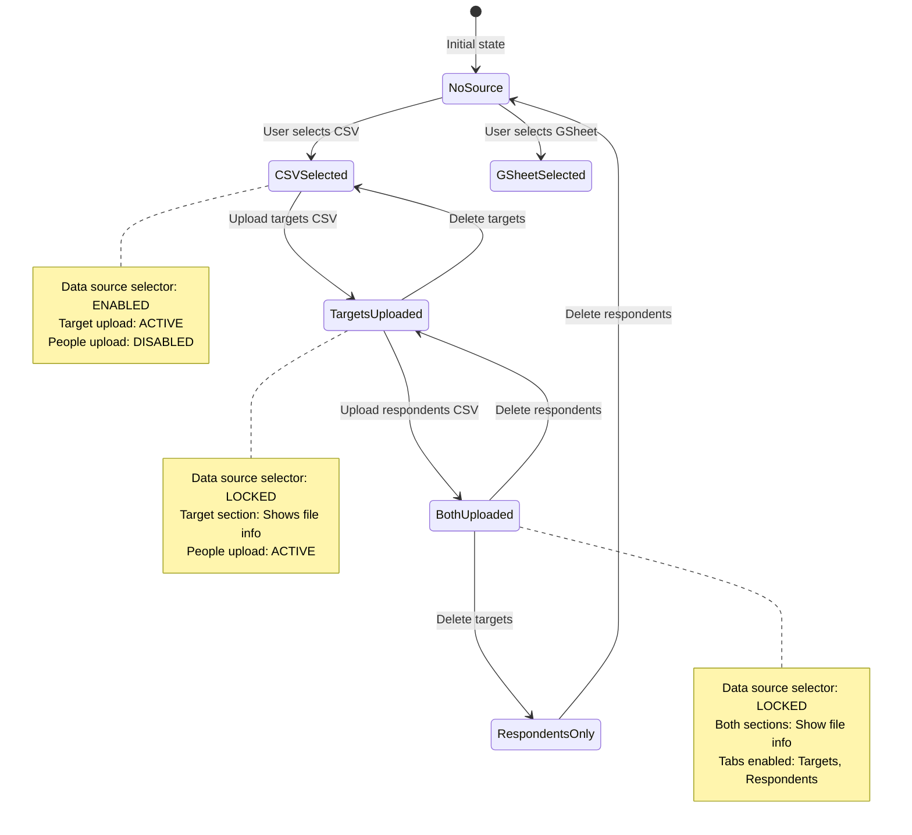

# 453 CSV Upload Implementation

This document tracks the implementation of the CSV upload feature for assemblies, allowing data import without using Google Spreadsheets.

## Branch: 453-csv-upload

## Overview

The goal is to add CSV file upload capability as an alternative to Google Spreadsheets for managing assembly data. This involves:

1. Adding new tabs (Targets, Respondents) to the assembly navigation
2. Implementing CSV upload UI on the Data tab
3. Integration with existing service layer functions for CSV parsing and import
4. Building the frontend patterns and documentation

---

## Phase 4: CSV Upload on Data Tab

### Figma Prototype Flow

The Figma prototype (see images 1-4 in this folder) shows the following flow:

 - Data source dropdown with options
 - Target upload active, People disabled
 - After Target upload, People becomes active
 - Both uploaded, showing file info

### Mermaid Flowchart



### State Machine



---

## Implementation Plan

### Step 1: Backend - Extend AssemblyCSV Domain Model

The existing `AssemblyCSV` model tracks `last_import_filename` and `last_import_timestamp` but these are for respondents only. We need to track targets separately.

**Current fields:**
- `last_import_filename: str` - Respondents filename
- `last_import_timestamp: datetime | None` - Respondents timestamp

**New fields to add:**
- `targets_filename: str` - Targets CSV filename
- `targets_uploaded_at: datetime | None` - Targets upload timestamp
- `targets_uploaded_by: uuid.UUID | None` - User who uploaded targets
- `respondents_filename: str` - Rename from `last_import_filename`
- `respondents_uploaded_at: datetime | None` - Rename from `last_import_timestamp`
- `respondents_uploaded_by: uuid.UUID | None` - User who uploaded respondents

**Alternative approach:** Use existing `TargetCategory` and `Respondent` counts to determine upload status:
- Targets uploaded = `len(get_targets_for_assembly(...)) > 0`
- Respondents uploaded = `len(uow.respondents.get_by_assembly_id(...)) > 0`

This avoids schema changes but loses filename/timestamp metadata.

**Recommendation:** Keep it simple - use counts to determine if data exists. We can add metadata fields later if needed.

### Step 2: Backend - Add Service Functions

Create/update in `assembly_service.py`:

```python
def get_csv_upload_status(
    uow: AbstractUnitOfWork,
    user_id: uuid.UUID,
    assembly_id: uuid.UUID,
) -> dict:
    """Get CSV upload status for an assembly.

    Returns:
        {
            "has_targets": bool,
            "targets_count": int,
            "has_respondents": bool,
            "respondents_count": int,
            "csv_config": AssemblyCSV | None,
        }
    """
```

Existing functions to reuse:
- `get_or_create_csv_config()` - Get/create CSV config
- `import_targets_from_csv()` - Import targets from CSV content
- `import_respondents_from_csv()` (in `respondent_service.py`) - Import respondents

Functions to add:
- `delete_targets_for_assembly()` - Delete all targets for an assembly
- `delete_respondents_for_assembly()` - Delete all respondents for an assembly (already exists as part of import with `replace_existing=True`)

### Step 3: Backend - Add Routes to Backoffice Blueprint

Add to `backoffice.py`:

```python
@backoffice_bp.route("/assembly/<uuid:assembly_id>/data/upload-targets", methods=["POST"])
def upload_targets_csv(assembly_id: uuid.UUID) -> ResponseReturnValue:
    """Handle targets CSV upload from Data tab."""

@backoffice_bp.route("/assembly/<uuid:assembly_id>/data/upload-respondents", methods=["POST"])
def upload_respondents_csv(assembly_id: uuid.UUID) -> ResponseReturnValue:
    """Handle respondents CSV upload from Data tab."""

@backoffice_bp.route("/assembly/<uuid:assembly_id>/data/delete-targets", methods=["POST"])
def delete_targets(assembly_id: uuid.UUID) -> ResponseReturnValue:
    """Delete all targets for an assembly."""

@backoffice_bp.route("/assembly/<uuid:assembly_id>/data/delete-respondents", methods=["POST"])
def delete_respondents(assembly_id: uuid.UUID) -> ResponseReturnValue:
    """Delete all respondents for an assembly."""
```

### Step 4: Frontend - Update Data Tab Template

Update `assembly_data.html` to show CSV upload panel when `data_source == "csv"`:

```jinja

    <section class="mb-8">
        <h2 class="text-heading-lg mb-4">{{ _("CSV Files Upload") }}</h2>

        {# Target Upload Section #}
        <div class="mb-6">
            <h3 class="text-heading-md mb-2">{{ _("Target") }}</h3>
            
                {# Show file info with Delete/Replace buttons #}
                <div class="flex items-center gap-4">
                    <dl class="flex gap-8">
                        <div>
                            <dt class="text-label-sm">{{ _("File name") }}</dt>
                            <dd>{{ targets_filename or "CSV" }}</dd>
                        </div>
                        <div>
                            <dt class="text-label-sm">{{ _("Uploaded on") }}</dt>
                            <dd>{{ targets_uploaded_at | format_date }}</dd>
                        </div>
                        <div>
                            <dt class="text-label-sm">{{ _("Uploaded by") }}</dt>
                            <dd>{{ targets_uploaded_by_name }}</dd>
                        </div>
                    </dl>
                    <div class="flex gap-2">
                        {{ button(_("Delete data"), variant="outline", ...) }}
                        {{ button(_("Replace Data"), variant="primary", ...) }}
                    </div>
                </div>
            
                {# Show Upload button #}
                <form method="POST" enctype="multipart/form-data"
                      action="{{ url_for('backoffice.upload_targets_csv', assembly_id=assembly.id) }}">
                    {{ targets_form.hidden_tag() }}
                    {{ file_input("targets_csv", label="", accept=".csv") }}
                    {{ button(_("Upload Data"), type="submit", variant="primary") }}
                </form>
            
        </div>

        <hr class="my-6">

        {# People/Respondents Upload Section #}
        <div class="mb-6">
            <h3 class="text-heading-md mb-2">{{ _("People") }}</h3>
            
                {# Show file info with Delete/Replace buttons #}
                ...
            
                {# Show Upload button (enabled after targets uploaded) #}
                <form method="POST" enctype="multipart/form-data"
                      action="{{ url_for('backoffice.upload_respondents_csv', assembly_id=assembly.id) }}">
                    ...
                </form>
            
                {# Show disabled Upload button #}
                {{ button(_("Upload Data"), disabled=true, variant="secondary") }}
            
        </div>
    </section>

```

### Step 5: Update Data Source Lock Logic

Modify `view_assembly_data()` in `backoffice.py`:

```python
# Current logic:
if gsheet:
    data_source = "gsheet"
    data_source_locked = True

# New logic:
csv_status = get_csv_upload_status(uow, user_id, assembly_id)
if gsheet:
    data_source = "gsheet"
    data_source_locked = True
elif csv_status["has_targets"] or csv_status["has_respondents"]:
    data_source = "csv"
    data_source_locked = True  # Lock once any CSV data exists
else:
    data_source = request.args.get("source", "")
    data_source_locked = False
```

### Step 6: Update Tab Enabled Logic

Modify tab enabled logic in all routes:

```python
# Current logic:
targets_enabled = gsheet is not None if data_source == "gsheet" else False

# New logic:
if data_source == "gsheet":
    targets_enabled = gsheet is not None
    respondents_enabled = gsheet is not None
elif data_source == "csv":
    csv_status = get_csv_upload_status(...)
    targets_enabled = csv_status["has_targets"]
    respondents_enabled = csv_status["has_respondents"]
else:
    targets_enabled = False
    respondents_enabled = False
```

### Step 7: Add BDD Tests

Add scenarios to `features/backoffice-csv-upload.feature`:

```gherkin
Scenario: CSV upload section appears when CSV source selected
    Given I am logged in as an admin user
    And there is an assembly called "CSV Upload Test"
    When I visit the assembly data page for "CSV Upload Test" with source "csv"
    Then I should see "CSV Files Upload"
    And I should see a "Target" section
    And I should see a "People" section

Scenario: Target upload is active, People upload is disabled initially
    Given I am logged in as an admin user
    And there is an assembly called "CSV Initial State"
    When I visit the assembly data page for "CSV Initial State" with source "csv"
    Then the Target "Upload Data" button should be enabled
    And the People "Upload Data" button should be disabled

Scenario: After uploading targets, People upload becomes active
    Given I am logged in as an admin user
    And there is an assembly called "CSV Targets Uploaded"
    And the assembly "CSV Targets Uploaded" has targets uploaded
    When I visit the assembly data page for "CSV Targets Uploaded"
    Then I should see the Target file info
    And the People "Upload Data" button should be enabled
    And the data source selector should be disabled

Scenario: Data source selector locks after first CSV upload
    Given I am logged in as an admin user
    And there is an assembly called "CSV Lock Test"
    And the assembly "CSV Lock Test" has targets uploaded
    When I visit the assembly data page for "CSV Lock Test"
    Then the data source selector should be disabled
```

---

## Implementation Progress

### Phase 1: Tab Navigation (Completed)

Added two new tabs to the assembly view navigation:

- **Targets** - For managing selection target categories (demographic quotas)
- **Respondents** - For managing participant/respondent data

#### Tab Behavior

| Condition | Targets Tab | Respondents Tab |
|-----------|-------------|-----------------|
| No data source configured | Disabled | Disabled |
| GSheet configured | Enabled (shows info box) | Enabled (shows info box) |
| CSV source, no upload yet | Disabled | Disabled |
| CSV source, targets uploaded | Enabled | Disabled |
| CSV source, both uploaded | Enabled | Enabled |

### Phase 2: UI Components (Completed)

Created a file input component (`file_input` macro) in `templates/backoffice/components/input.html`.

### Phase 3: GSheet Info Display (Completed)

For assemblies using Google Sheets as the data source, info boxes show the configured tab names.

### Phase 4: CSV Upload (In Progress)

See implementation plan above.

---

## Existing Service Layer Functions

### Targets

```python
# assembly_service.py

def import_targets_from_csv(
    uow: AbstractUnitOfWork,
    user_id: uuid.UUID,
    assembly_id: uuid.UUID,
    csv_content: str,
    replace_existing: bool = False,
) -> list[TargetCategory]:
    """Import target categories from CSV.

    CSV format: feature, value, min, max, min_flex, max_flex
    """

def get_targets_for_assembly(
    uow: AbstractUnitOfWork,
    user_id: uuid.UUID,
    assembly_id: uuid.UUID,
) -> list[TargetCategory]:
    """Get all target categories for an assembly."""
```

### Respondents

```python
# respondent_service.py

def import_respondents_from_csv(
    uow: AbstractUnitOfWork,
    user_id: uuid.UUID,
    assembly_id: uuid.UUID,
    csv_content: str,
    replace_existing: bool = False,
    id_column: str | None = None,
) -> tuple[list[Respondent], list[str], str]:
    """Import respondents from CSV.

    Returns: (respondents, errors, resolved_id_column)
    """
```

### CSV Config

```python
# assembly_service.py

def get_or_create_csv_config(
    uow: AbstractUnitOfWork,
    user_id: uuid.UUID,
    assembly_id: uuid.UUID,
) -> AssemblyCSV:
    """Get or create CSV configuration for an assembly."""

def update_csv_config(
    uow: AbstractUnitOfWork,
    user_id: uuid.UUID,
    assembly_id: uuid.UUID,
    **kwargs,
) -> AssemblyCSV:
    """Update CSV configuration fields."""
```

---

## Technical Notes

### Form Handling

Use existing forms from `forms.py`:
- `UploadTargetsCsvForm` - Simple file upload
- `UploadRespondentsCsvForm` - File upload + id_column + replace_existing

### File Upload Pattern

From `/backoffice/dev/patterns`:
1. Form with `enctype="multipart/form-data"`
2. Use `file_input` macro for styled input
3. Read file with `utf-8-sig` encoding (handles Excel BOM)
4. Pass content string to service layer

### CSP Compatibility

All Alpine.js code follows CSP-compatible patterns:
- Flat properties only in `x-model`
- No string arguments in click handlers
- CSRF token in fetch requests

---

## Related Documents

- [Frontend Patterns Documentation](/backoffice/dev/patterns) - Live examples
- [Service Docs](/backoffice/dev/service-docs) - Service layer testing
- [CSV Upload GDS Plan](../csv-upload-gds-plan.md) - Original planning
- [CSV Upload GDS Research](../csv-upload-gds-research.md) - Research notes
