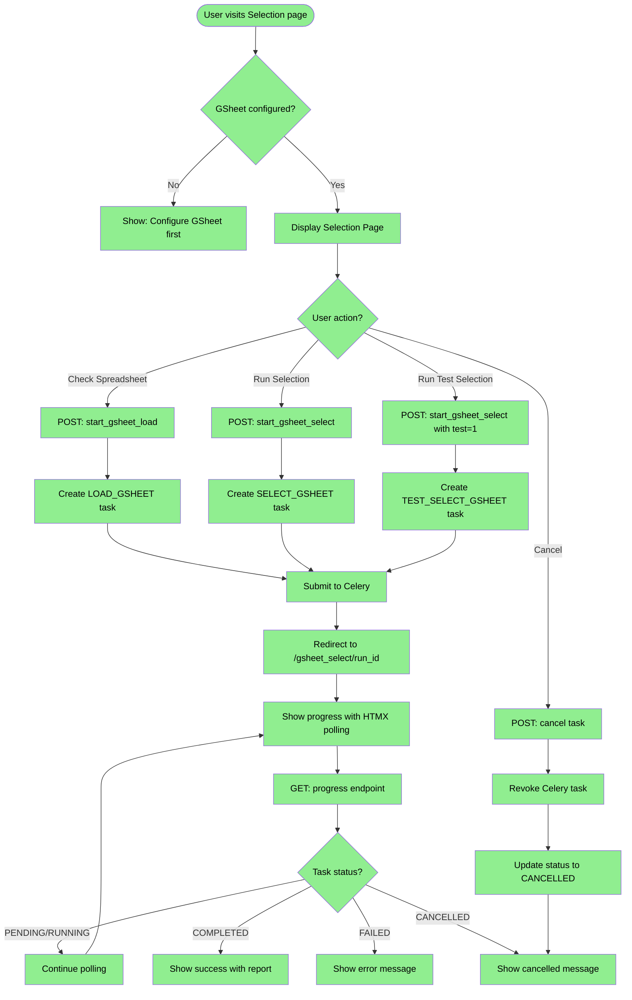
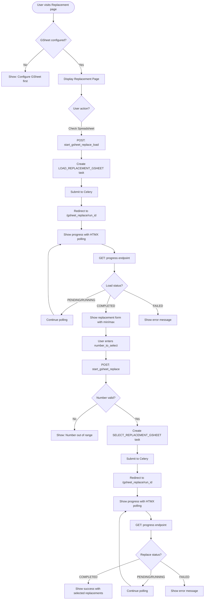
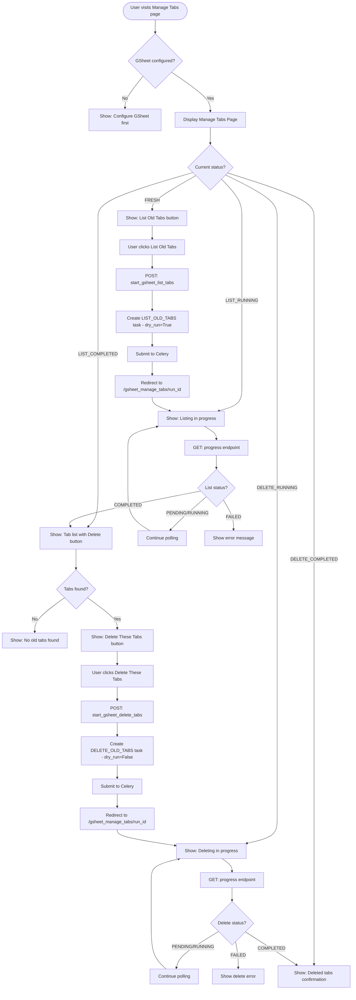

# Selection Tab Specification

**Branch:** `ghseet-selection-redesign`
**Last Updated:** 2026-02-25

## Overview

This document specifies the Selection tab functionality for the new backoffice UI. The Selection tab provides three core operations:

1. **Initial Selection** - Run sortition algorithm on initial participant data
2. **Replacement Selection** - Run sortition for replacement participants
3. **Manage Generated Tabs** - List and delete old output tabs in Google Sheets

In the old system, these are accessed via buttons on the data page (`/assemblies/<assembly_id>/data`). In the new backoffice, they will be under the "Selection" tab of the assembly data page.

## Implementation Progress Legend

| Symbol | Meaning |
|--------|---------|
| ✅ | Implemented and tested |
| 🔄 | In progress |
| ⬜ | Not yet implemented |

---

## Existing Flow Analysis

### Entry Points (Old System)

The existing implementation lives in `src/opendlp/entrypoints/blueprints/gsheets.py`:

#### Initial Selection Routes

| Route | Method | Function | Purpose |
|-------|--------|----------|---------|
| `/assemblies/<id>/gsheet_select` | GET | `select_assembly_gsheet` | Display selection page |
| `/assemblies/<id>/gsheet_select/<run_id>` | GET | `select_assembly_gsheet_with_run` | Display with task status |
| `/assemblies/<id>/gsheet_select/<run_id>/progress` | GET | `gsheet_select_progress` | HTMX polling endpoint |
| `/assemblies/<id>/gsheet_select` | POST | `start_gsheet_select` | Start selection task |
| `/assemblies/<id>/gsheet_load` | POST | `start_gsheet_load` | Validate spreadsheet data |
| `/assemblies/<id>/gsheet_select/<run_id>/cancel` | POST | `cancel_gsheet_select` | Cancel running task |

#### Replacement Selection Routes

| Route | Method | Function | Purpose |
|-------|--------|----------|---------|
| `/assemblies/<id>/gsheet_replace` | GET | `replace_assembly_gsheet` | Display replacement page |
| `/assemblies/<id>/gsheet_replace/<run_id>` | GET | `replace_assembly_gsheet_with_run` | Display with task status |
| `/assemblies/<id>/gsheet_replace/<run_id>/progress` | GET | `gsheet_replace_progress` | HTMX polling endpoint |
| `/assemblies/<id>/gsheet_replace_load` | POST | `start_gsheet_replace_load` | Validate replacement data |
| `/assemblies/<id>/gsheet_replace` | POST | `start_gsheet_replace` | Start replacement task |
| `/assemblies/<id>/gsheet_replace/<run_id>/cancel` | POST | `cancel_gsheet_replace` | Cancel running task |

#### Manage Generated Tabs Routes

| Route | Method | Function | Purpose |
|-------|--------|----------|---------|
| `/assemblies/<id>/gsheet_manage_tabs` | GET | `manage_assembly_gsheet_tabs` | Display tab management page |
| `/assemblies/<id>/gsheet_manage_tabs/<run_id>` | GET | `manage_assembly_gsheet_tabs_with_run` | Display with task results |
| `/assemblies/<id>/gsheet_manage_tabs/<run_id>/progress` | GET | `gsheet_manage_tabs_progress` | HTMX polling endpoint |
| `/assemblies/<id>/gsheet_list_tabs` | POST | `start_gsheet_list_tabs` | List old tabs (dry run) |
| `/assemblies/<id>/gsheet_delete_tabs` | POST | `start_gsheet_delete_tabs` | Delete old tabs |
| `/assemblies/<id>/gsheet_manage_tabs/<run_id>/cancel` | POST | `cancel_gsheet_manage_tabs` | Cancel running task |

---

### Service Layer Functions

Located in `src/opendlp/service_layer/sortition.py`:

#### Task Initiation Functions

| Function | Purpose | Task Type | Celery Task |
|----------|---------|-----------|-------------|
| `start_gsheet_load_task()` | Validate selection data | `LOAD_GSHEET` | `tasks.load_gsheet` |
| `start_gsheet_select_task()` | Run initial selection | `SELECT_GSHEET` or `TEST_SELECT_GSHEET` | `tasks.run_select` |
| `start_gsheet_replace_load_task()` | Validate replacement data | `LOAD_REPLACEMENT_GSHEET` | `tasks.load_gsheet` |
| `start_gsheet_replace_task()` | Run replacement selection | `SELECT_REPLACEMENT_GSHEET` | `tasks.run_select` |
| `start_gsheet_manage_tabs_task()` | List or delete old tabs | `LIST_OLD_TABS` or `DELETE_OLD_TABS` | `tasks.manage_old_tabs` |

#### Status and Monitoring Functions

| Function | Purpose |
|----------|---------|
| `get_selection_run_status()` | Get current task status with logs and report |
| `check_and_update_task_health()` | Monitor task health, mark dead tasks as failed |
| `cancel_task()` | Cancel running/pending task |
| `get_manage_old_tabs_status()` | Convert result to tab management status enum |
| `get_latest_run_for_assembly()` | Get most recent run for an assembly |

---

### Task Types

```
LOAD_GSHEET              - Validate initial selection data
SELECT_GSHEET            - Run initial selection (actual)
TEST_SELECT_GSHEET       - Run initial selection (test mode)
LOAD_REPLACEMENT_GSHEET  - Validate replacement data
SELECT_REPLACEMENT_GSHEET - Run replacement selection
LIST_OLD_TABS            - List old tabs (dry run)
DELETE_OLD_TABS          - Delete old tabs (actual)
```

### Task Statuses

```
PENDING    - Task created, waiting to start
RUNNING    - Task is executing
COMPLETED  - Task finished successfully
FAILED     - Task finished with error
CANCELLED  - Task was cancelled by user
```

---

## Flow Diagrams

### Initial Selection Flow



### Replacement Selection Flow



### Manage Generated Tabs Flow



---

## Data Models

### SelectionRunRecord

Tracks all task execution:

| Field | Type | Description |
|-------|------|-------------|
| `id` | UUID | Primary key |
| `task_id` | UUID | Task identifier |
| `assembly_id` | UUID | Assembly running the task |
| `task_type` | Enum | Type of task (see Task Types) |
| `status` | Enum | Current status (see Task Statuses) |
| `celery_task_id` | String | Celery task ID |
| `log_messages` | JSON | List of log messages from execution |
| `run_report` | JSON | Detailed report from sortition algorithms |
| `settings_used` | JSON | GSheet settings used for this run |
| `user_id` | UUID | User who initiated the task |
| `created_at` | DateTime | When task was created |
| `completed_at` | DateTime | When task finished (if applicable) |
| `error_message` | String | User-facing error message (if failed) |

### Result Types

| Type | Fields | Used For |
|------|--------|----------|
| `RunResult` | run_record, run_report, log_messages, success | Base result |
| `LoadRunResult` | + features, people | Load/validation tasks |
| `SelectionRunResult` | + selected_ids | Selection tasks |
| `TabManagementResult` | + tab_names | Tab management tasks |

### ManageOldTabsStatus Enum

```
FRESH            - No recent tab management task
LIST_RUNNING     - Listing tabs in progress
LIST_COMPLETED   - Tab listing complete
DELETE_RUNNING   - Deleting tabs in progress
DELETE_COMPLETED - Tab deletion complete
ERROR            - Task failed
```

---

## Error Messages

### Selection Errors

| Trigger | Message |
|---------|---------|
| No gsheet configured | "Please configure a Google Spreadsheet first" |
| Spreadsheet not found | "Could not access the spreadsheet. Please check the URL and permissions." |
| Missing required tab | "Required tab '%(tab)s' not found in spreadsheet" |
| Missing required column | "Required column '%(column)s' not found in tab '%(tab)s'" |
| No participants found | "No valid participants found in the spreadsheet" |
| Task timeout | "Task timed out after %(hours)s hours" |
| Task cancelled | "Task was cancelled" |
| Celery connection error | "Could not connect to task queue" |

### Replacement Errors

| Trigger | Message |
|---------|---------|
| Number out of range | "Number to select must be between %(min)s and %(max)s" |
| No remaining participants | "No remaining participants found for replacement" |
| Already selected tab missing | "Already selected tab '%(tab)s' not found" |

### Tab Management Errors

| Trigger | Message |
|---------|---------|
| Cannot list tabs | "Could not list tabs in spreadsheet" |
| Cannot delete tabs | "Could not delete tabs: %(error)s" |
| No tabs to delete | "No old tabs found to delete" |

---

## UI Components (New Design)

### Selection Section

**When no task is running:**
- Card header: "Initial Selection"
- Description text explaining the selection process
- Info box: "Number to select: X" (from assembly config)
- Buttons:
  - Primary: "Run Selection"
  - Secondary: "Run Test Selection"
  - Outline: "Check Spreadsheet"
- Link: "Manage Generated Tabs"

**When task is running:**
- Progress indicator with status
- Log messages display
- Cancel button (danger variant)

**When task completed:**
- Success/Error alert
- Report summary
- Link to view full report

### Replacement Section

**Initial state:**
- Card header: "Replacement Selection"
- Description text
- Button: "Check Spreadsheet" (loads and validates data)

**After validation (data loaded):**
- Success message showing min/max available
- Form field: "Number to select" (number input with validation)
- Button: "Run Replacements"

**When task is running:**
- Progress indicator
- Log messages
- Cancel button

### Manage Tabs Section

**Fresh state:**
- Card header: "Manage Generated Tabs"
- Description explaining what old tabs are
- Button: "List Old Tabs"

**After listing:**
- List of found tabs (if any)
- Button: "Delete These Tabs" (if tabs found)
- Button: "Refresh List"

**After deletion:**
- Confirmation message
- List of deleted tabs
- Button: "List Old Tabs" (to check again)

---

## Frontend Polling Approach

The backoffice uses Alpine.js components for task progress monitoring. Progress endpoints return JSON, and Alpine handles polling and state updates.

### Alpine Polling Component Pattern

```javascript
// Task progress polling component
function taskPoller(config) {
  return {
    status: 'PENDING',
    logMessages: [],
    report: null,
    errorMessage: null,
    pollInterval: null,

    init() {
      if (config.runId) {
        this.startPolling();
      }
    },

    startPolling() {
      this.pollInterval = setInterval(() => this.fetchProgress(), 2000);
      this.fetchProgress(); // immediate first fetch
    },

    async fetchProgress() {
      try {
        const response = await fetch(config.progressUrl);
        const data = await response.json();

        this.status = data.status;
        this.logMessages = data.log_messages || [];
        this.report = data.report;
        this.errorMessage = data.error_message;

        // Stop polling on terminal states
        if (['COMPLETED', 'FAILED', 'CANCELLED'].includes(data.status)) {
          this.stopPolling();
        }
      } catch (error) {
        console.error('Progress fetch failed:', error);
      }
    },

    stopPolling() {
      if (this.pollInterval) {
        clearInterval(this.pollInterval);
        this.pollInterval = null;
      }
    },

    destroy() {
      this.stopPolling();
    }
  };
}
```

### JSON Progress Endpoint Response

Progress endpoints return JSON:

```json
{
  "status": "RUNNING",
  "log_messages": [
    {"level": "info", "message": "Loading spreadsheet data..."},
    {"level": "info", "message": "Found 150 participants"}
  ],
  "report": null,
  "error_message": null,
  "completed_at": null
}
```

Terminal state example:
```json
{
  "status": "COMPLETED",
  "log_messages": [...],
  "report": {
    "selected_count": 30,
    "total_participants": 150,
    "selection_report_url": "/backoffice/assembly/.../selection/abc123/report"
  },
  "error_message": null,
  "completed_at": "2026-02-25T14:30:00Z"
}
```

---

## New Backoffice Routes

For the new backoffice implementation, the routes will be under `/backoffice/assembly/<id>/`:

| Route | Method | Purpose |
|-------|--------|---------|
| `/backoffice/assembly/<id>/selection` | GET | Selection tab page |
| `/backoffice/assembly/<id>/selection/load` | POST | Validate selection data |
| `/backoffice/assembly/<id>/selection/run` | POST | Run selection |
| `/backoffice/assembly/<id>/selection/<run_id>` | GET | Selection with run status |
| `/backoffice/assembly/<id>/selection/<run_id>/progress` | GET | HTMX progress polling |
| `/backoffice/assembly/<id>/selection/<run_id>/cancel` | POST | Cancel task |
| `/backoffice/assembly/<id>/selection/<run_id>/report` | GET | View full selection report |
| `/backoffice/assembly/<id>/replacement` | GET | Replacement page |
| `/backoffice/assembly/<id>/replacement/load` | POST | Validate replacement data |
| `/backoffice/assembly/<id>/replacement/run` | POST | Run replacement |
| `/backoffice/assembly/<id>/replacement/<run_id>` | GET | Replacement with run status |
| `/backoffice/assembly/<id>/replacement/<run_id>/progress` | GET | HTMX progress polling |
| `/backoffice/assembly/<id>/replacement/<run_id>/cancel` | POST | Cancel task |
| `/backoffice/assembly/<id>/manage-tabs` | GET | Manage tabs page |
| `/backoffice/assembly/<id>/manage-tabs/list` | POST | List old tabs |
| `/backoffice/assembly/<id>/manage-tabs/delete` | POST | Delete old tabs |
| `/backoffice/assembly/<id>/manage-tabs/<run_id>` | GET | Manage tabs with run status |
| `/backoffice/assembly/<id>/manage-tabs/<run_id>/progress` | GET | HTMX progress polling |
| `/backoffice/assembly/<id>/manage-tabs/<run_id>/cancel` | POST | Cancel task |

---

## Implementation Plan

### Phase 1: Selection Tab - Basic Structure ✅

1. ✅ Add "Selection" tab to assembly data page navigation
2. ✅ Create selection page template with three sections
3. ✅ Implement basic routes (without task functionality)

### Phase 2: Initial Selection 🔄

**Phase 2a: Progress Endpoint & Alpine Polling**
1. ✅ Add `/selection/<run_id>` GET route (view with run status)
2. ✅ Add `/selection/<run_id>/progress` GET route (JSON for Alpine polling)
3. ✅ Create Alpine polling component (`taskPoller` in alpine-components.js)
4. ✅ Update template to conditionally show progress UI

**Phase 2b: Check Spreadsheet (Load)**
1. ✅ Add `/selection/load` POST route (starts LOAD_GSHEET task)
2. ✅ Enable "Check Spreadsheet" button
3. ✅ Display load results (participant count, validation errors)

**Phase 2c: Run Selection**
1. ✅ Add `/selection/run` POST route (starts SELECT_GSHEET task)
2. ✅ Support `test=1` query param for test selection
3. ✅ Enable "Run Selection" and "Run Test Selection" buttons
4. ⬜ Display selection results summary (selected count, demographics breakdown)
5. ⬜ Add "View Full Report" link to detailed report page

**Phase 2d: Cancel & Error Handling**
1. ✅ Add `/selection/<run_id>/cancel` POST route
2. ✅ Add cancel button during task execution
3. ✅ Handle error states gracefully

**Phase 2e: Testing**
1. ✅ Add BDD tests for selection functionality
2. ✅ Add manual test cases (TC-S07 through TC-S18)

### Phase 3: Replacement Selection ⬜

1. Implement `view_replacement` route
2. Implement `start_replacement_load` route
3. Implement `start_replacement_run` route with form
4. Add HTMX progress polling
5. Add cancel functionality
6. Add tests

### Phase 4: Manage Generated Tabs ⬜

1. Implement `view_manage_tabs` route
2. Implement `start_list_tabs` route
3. Implement `start_delete_tabs` route
4. Add HTMX progress polling
5. Add cancel functionality
6. Add tests

### Phase 5: Selection History ⬜

**Goal:** Add a comprehensive selection run history section at the bottom of the Selection tab, showing all previous runs with pagination.

#### Data Layer

**Repository Method:** `SelectionRunRecordRepository.get_by_assembly_id_paginated()`
- **Location:** `src/opendlp/adapters/sql_repository.py:489`
- **Signature:** `get_by_assembly_id_paginated(assembly_id: UUID, page: int = 1, per_page: int = 50) -> tuple[list[tuple[SelectionRunRecord, User | None]], int]`
- **Returns:** Tuple of (list of (SelectionRunRecord, User) pairs, total_count)
- **Implementation:**
  - Uses LEFT JOIN to get user information alongside each run record
  - Joins `SelectionRunRecord` with `User` on `user_id`
  - Filters by `assembly_id`
  - Orders by `created_at DESC` (most recent first)
  - Uses SQLAlchemy pagination with `limit()` and `offset()`

**SelectionRunRecord Fields:**
- `task_id`: UUID - Primary key
- `assembly_id`: UUID - Foreign key to Assembly
- `user_id`: UUID | None - Foreign key to User who started the run
- `task_type`: SelectionTaskType enum - Type of task (see Task Types)
- `status`: SelectionRunStatus enum - Current status (see Task Statuses)
- `created_at`: datetime - When task was created
- `completed_at`: datetime | None - When task finished
- `comment`: str - User comment (max 512 chars)
- `error_message`: str - User-facing error message if failed
- `log_messages`: list[str] - Log messages from execution (JSON)
- `run_report`: RunReport - Detailed report from sortition (JSON)
- `selected_ids`: list[list[str]] | None - Selected participant IDs (JSON)
- `remaining_ids`: list[str] | None - Remaining pool IDs (JSON)
- `settings_used`: dict[str, Any] - GSheet settings used (JSON)
- `status_stages`: list[dict] | None - Stage progress (JSON)
- `celery_task_id`: str - Celery task ID for tracking

**Helper Properties:**
- `task_type_verbose`: Converts enum to readable string (e.g., "Load google spreadsheet")
- `has_finished`: Boolean - True if status is completed, failed, or cancelled
- `is_pending`, `is_running`, `is_completed`, `is_failed`, `is_cancelled`: Status checks

#### UI Components

**Section Structure:**
```html
<section class="mt-8">
  <h2>Selection Run History</h2>

  <!-- Pagination info -->
  <p>Showing X to Y of Z runs</p>

  <!-- History table -->
  <table>
    <thead>
      <tr>
        <th>Status</th>
        <th>Task Type</th>
        <th>Started By</th>
        <th>Started At</th>
        <th>Completed At</th>
        <th>Comment</th>
        <th>Actions</th>
      </tr>
    </thead>
    <tbody>
      <!-- Rows for each run -->
    </tbody>
  </table>

  <!-- Pagination controls -->
  <nav><!-- pagination --></nav>
</section>
```

**Table Columns:**

1. **Status** - Tag/badge with color coding:
   - `pending` → Grey tag: "Pending"
   - `running` → Blue tag: "Running"
   - `completed` → Green tag: "Completed"
   - `failed` → Red tag: "Failed"
   - `cancelled` → Yellow tag: "Cancelled"

2. **Task Type** - Display `run_record.task_type_verbose`:
   - Examples: "Load google spreadsheet", "Select google spreadsheet", "Test select google spreadsheet", etc.

3. **Started By** - User who initiated the task:
   - Show `user.display_name` or `user.email` if user exists
   - Show "Unknown" if user is None (user might have been deleted)

4. **Started At** - Formatted datetime:
   - Format: `"%d %b %Y %H:%M"` (e.g., "04 Mar 2026 14:30")
   - Show "N/A" if `created_at` is None

5. **Completed At** - Formatted datetime:
   - Format: `"%d %b %Y %H:%M"`
   - Show "N/A" if `completed_at` is None (still running/pending)

6. **Comment** - User's comment when starting the run:
   - Show comment text or "None" if empty
   - Max 512 characters

7. **Actions** - Link to view run details:
   - "View" link → Routes to `view_run_details` endpoint

**Pagination Controls:**
- Show "Previous" and "Next" buttons
- Show page numbers with ellipsis for skipped pages
- Display window: current page ±2, always show first and last
- Example: `1 ... 8 9 [10] 11 12 ... 25`
- Only show pagination if `total_pages > 1`

**Empty State:**
- If no runs exist: "No selection runs have been performed yet."

#### Routes

| Route | Method | Purpose |
|-------|--------|---------|
| `/backoffice/assembly/<id>/selection` | GET | Main selection page with history section |
| `/backoffice/assembly/<id>/selection/history/<run_id>` | GET | View details of a specific run |

**Query Parameters:**
- `page`: int - Page number for pagination (default: 1)
- `per_page`: int - Items per page (fixed at 50, not exposed to users)

#### View Run Details Endpoint

**Existing Endpoint:** `gsheets.view_gsheet_run`
- **Route:** `/assemblies/<assembly_id>/gsheet_runs/<run_id>/view`
- **Purpose:** Generic redirect endpoint that routes to task-specific view
- **Logic:**
  1. Fetch the `SelectionRunRecord` by `run_id`
  2. Validate `run_record.assembly_id == assembly_id`
  3. Map `task_type` to appropriate view:
     - `LOAD_GSHEET`, `SELECT_GSHEET`, `TEST_SELECT_GSHEET` → `select_assembly_gsheet_with_run`
     - `LOAD_REPLACEMENT_GSHEET`, `SELECT_REPLACEMENT_GSHEET` → `replace_assembly_gsheet_with_run`
     - `LIST_OLD_TABS`, `DELETE_OLD_TABS` → `manage_assembly_gsheet_tabs_with_run`

**For Backoffice:**
- Create similar redirect endpoint: `/backoffice/assembly/<id>/selection/history/<run_id>`
- Redirect to appropriate backoffice section based on task type:
  - Initial selection tasks → `/backoffice/assembly/<id>/selection?run_id=<run_id>`
  - Replacement tasks → `/backoffice/assembly/<id>/replacement?run_id=<run_id>` (Phase 3)
  - Tab management tasks → `/backoffice/assembly/<id>/manage-tabs?run_id=<run_id>` (Phase 4)

#### Implementation Steps

1. ⬜ Update `view_assembly_selection` route to fetch paginated run history
   - Add pagination params: `page = request.args.get("page", 1, type=int)`
   - Call `uow.selection_run_records.get_by_assembly_id_paginated(assembly_id, page, per_page=50)`
   - Calculate `total_pages = (total_count + per_page - 1) // per_page`
   - Pass `run_history`, `page`, `total_count`, `total_pages` to template

2. ⬜ Update `assembly_selection.html` template to add history section
   - Add section after "Manage Generated Tabs" card
   - Include table with all columns as specified
   - Add pagination controls using GOV.UK pagination component pattern
   - Handle empty state

3. ⬜ Create `view_run_details` redirect endpoint
   - Route: `/backoffice/assembly/<id>/selection/history/<run_id>`
   - Fetch run record and validate assembly ownership
   - Redirect to appropriate section based on task type
   - Handle errors (run not found, wrong assembly, etc.)

4. ⬜ Add tests
   - Unit tests for pagination logic
   - E2E tests for history display
   - Test pagination controls
   - Test run details redirect
   - Test permission checks

#### Reference Implementation

**Old Design Template:** `templates/main/view_assembly_data.html:39-171`
**Old Design Route:** `main_bp.view_assembly_data` in `entrypoints/blueprints/main.py:89-133`
**Repository Implementation:** `sql_repository.py:489-515`

#### Notes

- The history section should show ALL task types (load, select, replace, manage tabs)
- Users should be able to click "View" to see the detailed results of any past run
- The pagination should maintain the current page when navigating back from run details
- Consider adding a "Filter by Task Type" dropdown in future iterations (not in this phase)

---

## Testing Checklist

### Unit Tests (Service Layer)
- [ ] `start_gsheet_load_task` creates correct task
- [ ] `start_gsheet_select_task` creates selection task
- [ ] `start_gsheet_select_task` with test=True creates test task
- [ ] `start_gsheet_replace_load_task` creates correct task
- [ ] `start_gsheet_replace_task` validates number range
- [ ] `start_gsheet_manage_tabs_task` with dry_run=True creates list task
- [ ] `start_gsheet_manage_tabs_task` with dry_run=False creates delete task
- [ ] `get_selection_run_status` returns correct status
- [ ] `cancel_task` revokes and updates status
- [ ] `check_and_update_task_health` marks dead tasks as failed

### E2E Tests (Backoffice Routes)

**Selection Page ⬜**
- [ ] Page loads with gsheet configured
- [ ] Page shows error when no gsheet configured
- [ ] Check Spreadsheet starts load task
- [ ] Run Selection starts select task
- [ ] Run Test Selection starts test select task
- [ ] Progress polling works
- [ ] Cancel task works
- [ ] Success state displays report
- [ ] Error state displays message

**Replacement Page ⬜**
- [ ] Page loads with gsheet configured
- [ ] Check Spreadsheet starts load task
- [ ] Form shows after successful load
- [ ] Form validates number range
- [ ] Run Replacement starts task
- [ ] Progress polling works
- [ ] Cancel task works

**Manage Tabs Page ⬜**
- [ ] Page loads with gsheet configured
- [ ] List Old Tabs starts list task
- [ ] Delete buttons shown when tabs found
- [ ] Delete tabs starts delete task
- [ ] Progress polling works
- [ ] Cancel task works

**Permissions ⬜**
- [ ] Unauthorized users cannot access selection pages
- [ ] Unauthorized users cannot start tasks
- [ ] Unauthorized users cannot cancel tasks
