# OpenDLP Backend Architecture

This document provides a visual and textual overview of the Flask backend architecture, including blueprints, services, and their relationships.

## Table of Contents

- [High-Level Architecture](#high-level-architecture)
- [Blueprint Overview](#blueprint-overview)
- [Service Layer Overview](#service-layer-overview)
- [Blueprint-Service Dependencies](#blueprint-service-dependencies)
- [Detailed Blueprint Analysis](#detailed-blueprint-analysis)
- [Detailed Service Analysis](#detailed-service-analysis)
- [Developer Tools (/dev/)](#developer-tools-dev)

---

## High-Level Architecture

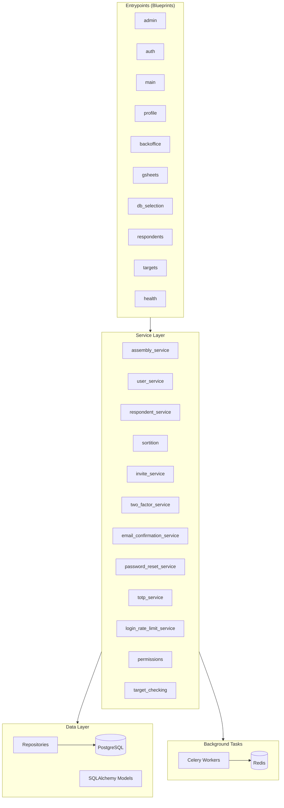

---

## Blueprint Overview

All blueprints are located in `src/opendlp/entrypoints/blueprints/`.

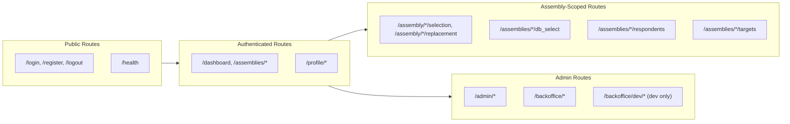

### Blueprint Summary Table

| Blueprint | URL Prefix | Purpose | Auth Required | Admin Only |
|-----------|------------|---------|---------------|------------|
| `health` | `/health` | Health checks | No | No |
| `auth` | `/` | Login, register, password reset, OAuth | No | No |
| `main` | `/` | Dashboard, assembly CRUD | Yes | No |
| `profile` | `/profile` | User profile, 2FA settings | Yes | No |
| `gsheets` | `/assembly` | Google Sheets selection/replacement | Yes | No |
| `db_selection` | `/assemblies` | Database-based selection | Yes | No |
| `respondents` | `/assemblies` | Respondent management | Yes | No |
| `targets` | `/assemblies` | Target management | Yes | No |
| `admin` | `/admin` | User and invite management | Yes | Yes |
| `backoffice` | `/backoffice` | New admin interface | Yes | Yes |

---

## Service Layer Overview

All services are located in `src/opendlp/services/`.

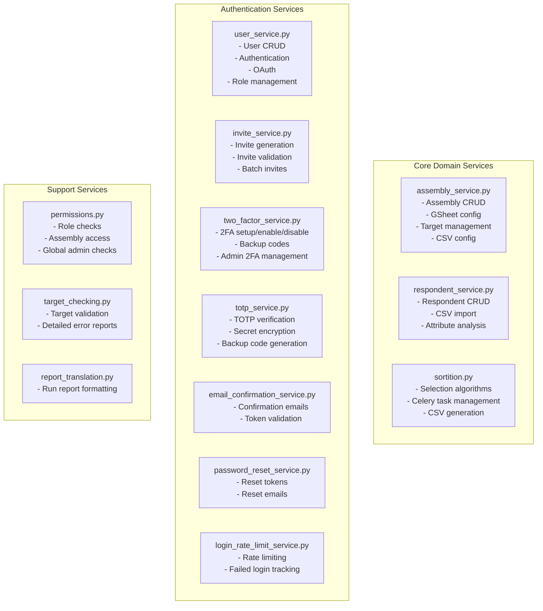

### Service Summary Table

| Service | Primary Responsibility | Key Dependencies |
|---------|----------------------|------------------|
| `assembly_service` | Assembly CRUD, targets, CSV config | Repositories, respondent_service |
| `respondent_service` | Respondent management | Repositories |
| `sortition` | Selection/replacement tasks | Celery, Redis, assembly_service |
| `user_service` | User management, auth | Repositories, invite_service |
| `invite_service` | Invite lifecycle | Repositories |
| `two_factor_service` | 2FA management | totp_service, Repositories |
| `totp_service` | TOTP crypto operations | pyotp, cryptography |
| `email_confirmation_service` | Email verification | Email sender |
| `password_reset_service` | Password recovery | Email sender |
| `login_rate_limit_service` | Login rate limiting | Redis/DB |
| `permissions` | Authorization checks | User context |
| `target_checking` | Target validation | respondent_service |

---

## Blueprint-Service Dependencies

This diagram shows which services each blueprint depends on.

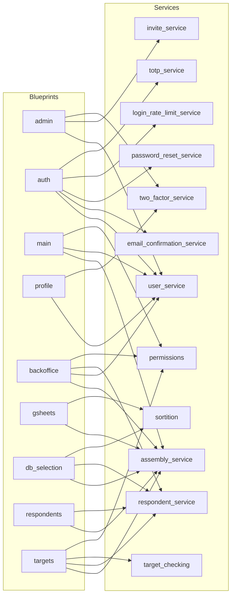

### Dependency Matrix

|                  | assembly | user | respondent | sortition | invite | 2fa | email_confirm | pass_reset | totp | rate_limit | permissions | target_check |
|------------------|:--------:|:----:|:----------:|:---------:|:------:|:---:|:-------------:|:----------:|:----:|:----------:|:-----------:|:------------:|
| **admin**        |          |  ✓   |            |           |   ✓    |  ✓  |               |            |      |            |             |              |
| **auth**         |          |  ✓   |            |           |        |     |       ✓       |     ✓      |  ✓   |     ✓      |             |              |
| **main**         |    ✓     |  ✓   |            |           |        |     |               |            |      |            |      ✓      |              |
| **profile**      |          |  ✓   |            |           |        |  ✓  |               |            |      |            |             |              |
| **backoffice**   |    ✓     |  ✓   |     ✓      |           |        |     |               |            |      |            |      ✓      |              |
| **gsheets**      |    ✓     |      |            |     ✓     |        |     |               |            |      |            |             |              |
| **db_selection** |    ✓     |      |     ✓      |     ✓     |        |     |               |            |      |            |             |              |
| **respondents**  |    ✓     |      |     ✓      |           |        |     |               |            |      |            |             |              |
| **targets**      |    ✓     |      |     ✓      |           |        |     |               |            |      |            |      ✓      |      ✓       |

---

## Detailed Blueprint Analysis

### admin Blueprint

**File:** `blueprints/admin.py`

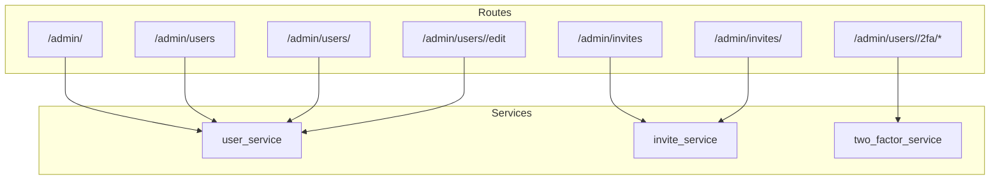

**Route Count:** 11 routes
**Service Dependencies:** 3 services

---

### auth Blueprint

**File:** `blueprints/auth.py`

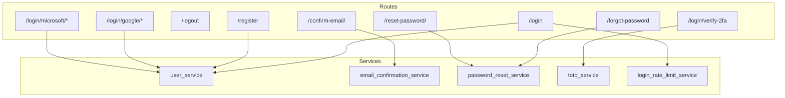

**Route Count:** 15+ routes (including OAuth variants)
**Service Dependencies:** 5 services (highest)

---

### backoffice Blueprint

**File:** `blueprints/backoffice.py`

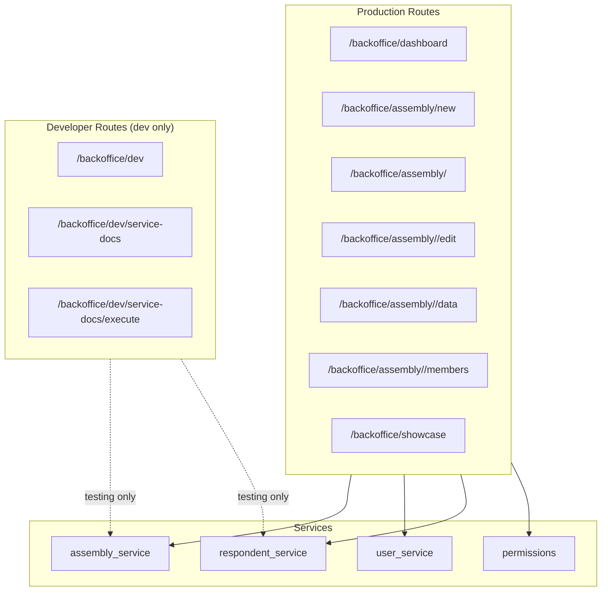

**Route Count:** 15+ production routes + 3 dev routes
**Service Dependencies:** 4 services

---

### gsheets Blueprint

**File:** `blueprints/gsheets.py`

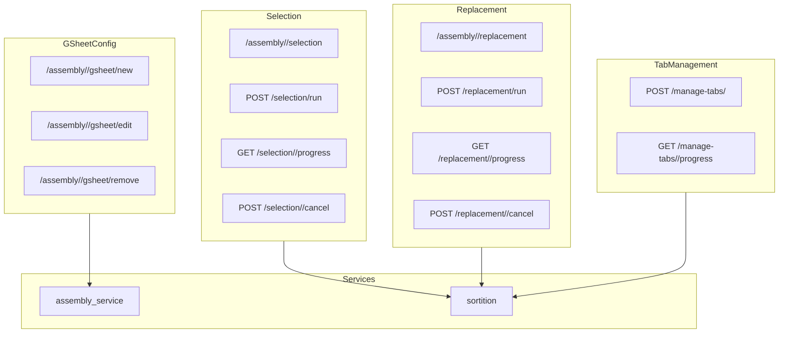

**Route Count:** 14 routes
**Service Dependencies:** 2 services

---

### db_selection Blueprint

**File:** `blueprints/db_selection.py`

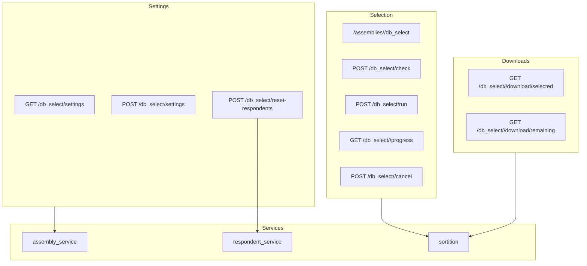

**Route Count:** 12 routes
**Service Dependencies:** 3 services

---

## Detailed Service Analysis

### assembly_service.py

This is the largest service, handling assembly lifecycle and related entities.

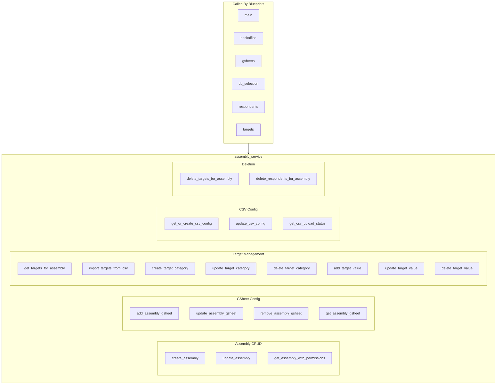

**Function Count:** 20+ functions
**Potential Split Candidates:**
- Target management could be `target_service.py`
- GSheet config could be `gsheet_config_service.py`
- CSV config could be `csv_config_service.py`

---

### sortition.py

Handles all selection-related background tasks.

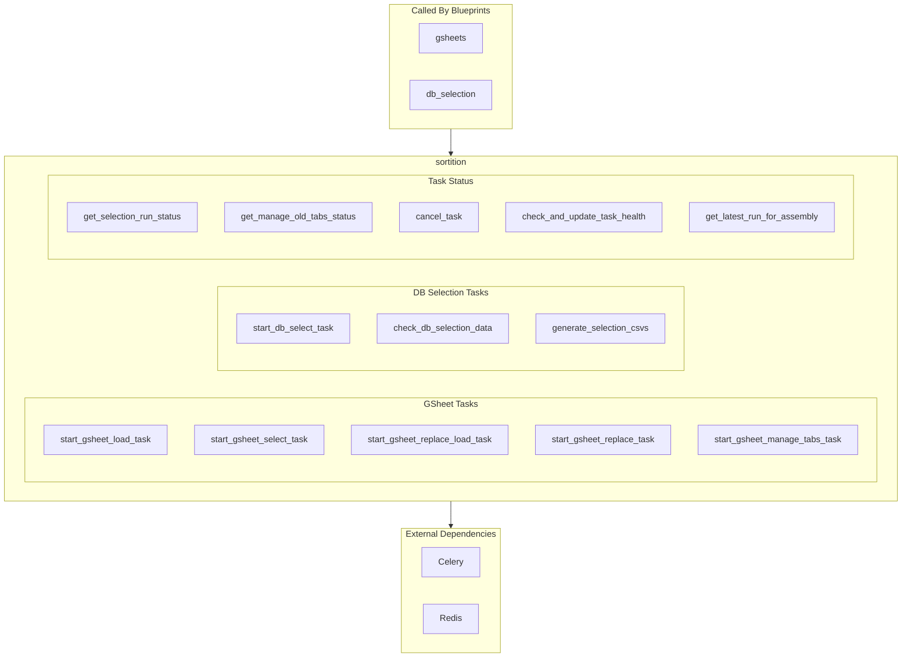

**Function Count:** 12+ functions
**Potential Split Candidates:**
- GSheet tasks could be `gsheet_sortition.py`
- DB tasks could be `db_sortition.py`

---

### user_service.py

Handles user lifecycle and authentication.

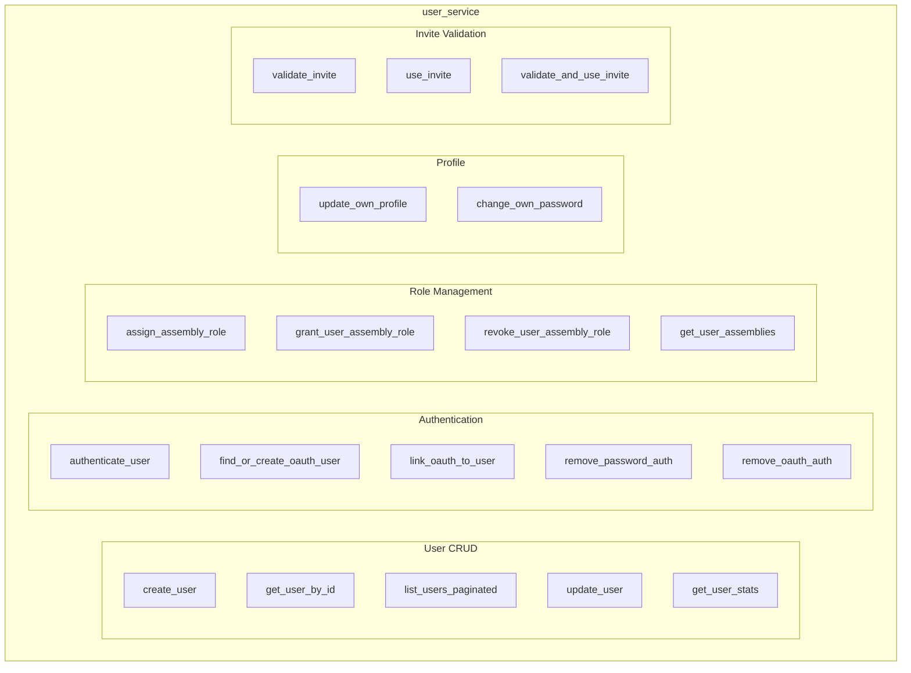

**Function Count:** 18+ functions
**Well-organized:** Functions are grouped by responsibility

---

## Developer Tools (/dev/)

The `/backoffice/dev/` routes provide interactive testing for the service layer.

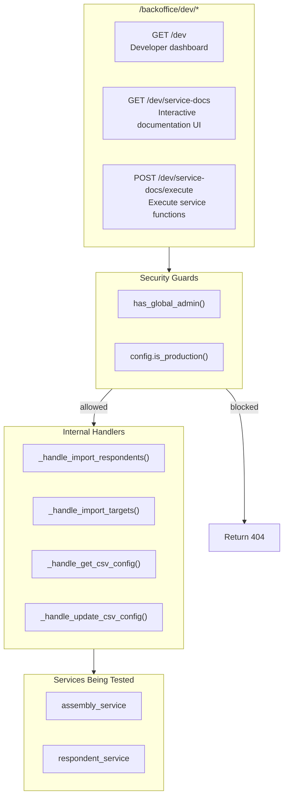

### Current /dev/ Implementation Issues

1. **Mixed Concerns:** Dev routes are in the same file as production `backoffice` routes
2. **No Separation:** Dev handlers use the same service imports as production code
3. **Limited Coverage:** Only tests a few service functions

### Recommended Structure

```
blueprints/
├── backoffice.py          # Production routes only
└── dev/                   # Development-only routes
    ├── __init__.py
    ├── dashboard.py       # /backoffice/dev
    └── service_docs.py    # /backoffice/dev/service-docs
```

---

## Observations and Recommendations

### Blueprint Observations

| Blueprint | Routes | Services | Notes |
|-----------|--------|----------|-------|
| `admin` | 11 | 3 | Well-focused |
| `auth` | 15+ | 5 | Complex but necessary |
| `main` | 10 | 3 | Could split assembly routes |
| `profile` | 15 | 2 | Well-focused |
| `backoffice` | 18+ | 4 | **Mixed prod/dev routes** |
| `gsheets` | 14 | 2 | Well-focused |
| `db_selection` | 12 | 3 | Well-focused |
| `respondents` | 3 | 2 | Small, focused |
| `targets` | 10 | 4 | Well-focused |

### Service Observations

| Service | Functions | Callers | Notes |
|---------|-----------|---------|-------|
| `assembly_service` | 20+ | 6 blueprints | **Could be split** |
| `user_service` | 18+ | 4 blueprints | Well-organized |
| `respondent_service` | 8+ | 4 blueprints | Focused |
| `sortition` | 12+ | 2 blueprints | **Could split GSheet/DB** |
| `invite_service` | 6 | 1 blueprint | Focused |
| `two_factor_service` | 7 | 2 blueprints | Focused |

### Recommendations

1. **Separate dev routes:** Extract `/backoffice/dev/*` routes into a separate blueprint module
2. **Consider splitting `assembly_service`:** Target management and CSV config are distinct concerns
3. **Consider splitting `sortition`:** GSheet and DB selection are separate workflows
4. **Standardize route patterns:** Some blueprints use `/assembly/<id>`, others use `/assemblies/<id>`
