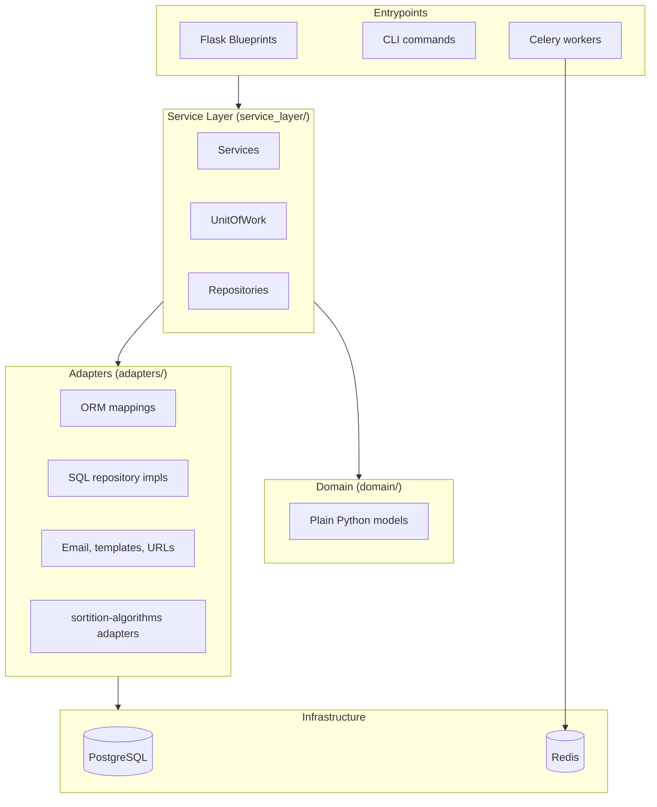
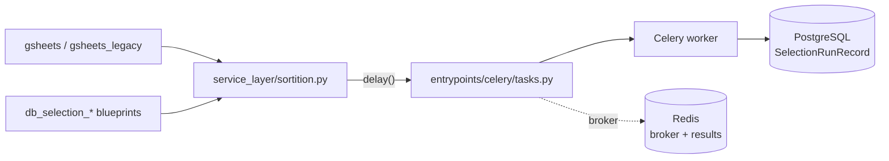
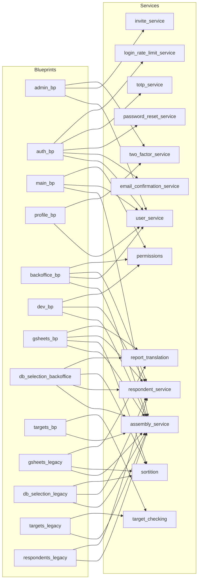

# OpenDLP Backend Architecture

This document provides a visual and textual overview of the Flask backend architecture, including blueprints, services, adapters, and their relationships.

## Table of Contents

- [High-Level Architecture](#high-level-architecture)
- [Blueprint Overview](#blueprint-overview)
- [Service Layer Overview](#service-layer-overview)
- [Adapters Layer](#adapters-layer)
- [Background Tasks](#background-tasks)
- [Blueprint-Service Dependencies](#blueprint-service-dependencies)
- [Developer Tools (/backoffice/dev/)](#developer-tools-backofficedev)
- [Observations and Recommendations](#observations-and-recommendations)

---

## High-Level Architecture

The backend follows the DDD layout from *Architecture Patterns with Python*: plain-Python domain objects, imperative SQLAlchemy mappings in adapters, repositories and a UnitOfWork in the service layer, and Flask blueprints as entrypoints.



Source directories:

```txt
src/opendlp/
    domain/            # Plain-Python domain objects
    adapters/          # SQLAlchemy ORM, email, templates, sortition-algorithms adapters
    service_layer/     # Services, repositories, UnitOfWork, permissions
    entrypoints/
        blueprints/    # Flask blueprints
        celery/        # Celery app + task definitions
        cli/           # Click CLI commands
        flask_app.py   # App factory
```

---

## Blueprint Overview

All blueprints live in `src/opendlp/entrypoints/blueprints/` and are registered in `flask_app.py::register_blueprints`.

### Legacy vs. backoffice blueprints

The backoffice UI is being rebuilt on the GOV.UK Design System. Several features have paired blueprints during the transition:

| Legacy (Bootstrap UI, top-level URLs) | Backoffice (GOV.UK UI, `/backoffice/...`) |
|---|---|
| `gsheets_legacy.py` | `gsheets.py` |
| `db_selection_legacy.py` | `db_selection_backoffice.py` |
| `targets_legacy.py` | `targets.py` |
| `respondents_legacy.py` | *(rolled into `backoffice.py`; dedicated blueprint split-out pending)* |

The `*_legacy` blueprints will be retired: first their links are removed from the main navigation, then the code is deleted once the GOV.UK equivalents are trusted.

### Blueprint summary

| Blueprint | URL prefix | Purpose | Auth | Routes |
|---|---|---|---|---|
| `wellknown` | — | robots.txt, security.txt, change-password redirect | Public | 3 |
| `health` | — | JSON health check (`/health`, `/health/bdd`) | Public | 2 |
| `auth` | `/auth` | Login, register, password reset, email confirmation, Google/Microsoft OAuth, 2FA verify | Mixed | 18 |
| `main` | — | Landing page, dashboard, assembly view, legacy member management | Mixed | 11 |
| `profile` | — (mounts at `/profile/...`) | Self-service profile, password change, OAuth linking, 2FA setup | Login | 15 |
| `admin` | `/admin` | User and invite management, admin 2FA controls | Admin | 11 |
| `backoffice` | `/backoffice` | Assembly dashboard/CRUD, data upload, members, showcase; currently also hosts respondent pages | Login | 16 |
| `gsheets` | `/backoffice` | Google Sheets config, selection, replacement, tab management (GOV.UK UI) | Login + assembly mgr | 19 |
| `db_selection_backoffice` | `/backoffice` | Database-driven selection (GOV.UK UI) | Login + assembly mgr | 8 |
| `targets` | `/backoffice` | Target categories/values, CSV upload, target checking (GOV.UK UI) | Login + assembly mgr | 14 |
| `gsheets_legacy` | — | Legacy Google Sheets workflow | Login + assembly mgr | 21 |
| `db_selection_legacy` | — | Legacy database selection + settings | Login + assembly mgr | 12 |
| `targets_legacy` | — | Legacy target management | Login + assembly mgr | 11 |
| `respondents_legacy` | — | Legacy respondent listing + CSV upload | Login | 3 |
| `dev` | `/backoffice` | Interactive service-layer docs, frontend pattern showcase (dev builds only) | Admin | 4 |

Notes:
- The `dev` blueprint is only registered when `config.is_production()` is false.
- Legacy URLs use `/assemblies/<id>/...`; newer GOV.UK URLs use `/backoffice/assembly/<id>/...` (note the singular `assembly`).
- `auth_bp` previously mounted at `/`; it now mounts at `/auth`.

---

## Service Layer Overview

All services live in `src/opendlp/service_layer/`. Services depend on repositories accessed through the `UnitOfWork`; they return plain-Python domain objects.

### Service summary

| Module | Purpose | Key dependencies |
|---|---|---|
| `assembly_service` | Assembly CRUD, GSheet config, target categories/values, CSV config, selection settings | SQLAlchemy, `sortition-algorithms` |
| `respondent_service` | Respondent CRUD, CSV import, attribute analysis | CSV parsing, permissions |
| `sortition` | Celery task dispatch for GSheet + DB selection workflows; run status/cancellation/health | `celery`, `sortition-algorithms`, `error_translation`, `report_translation` |
| `user_service` | User lifecycle, authentication, OAuth linking, assembly role management, profile updates | email adapter, template renderer, URL generator, `security` |
| `invite_service` | Invite generation (single/batch), validation, revocation, cleanup | user domain, permissions |
| `permissions` | Role checks (`can_manage_assembly`, `has_global_admin`, …) and decorators | domain value objects |
| `two_factor_service` | 2FA setup/enable/disable/verify, backup code lifecycle | `totp_service` |
| `totp_service` | TOTP secret generation, Fernet encryption, QR codes, verification | `pyotp`, `cryptography`, `qrcode` |
| `email_confirmation_service` | Email verification tokens with rate limiting + anti-enumeration | email adapter, template renderer, URL generator |
| `password_reset_service` | Reset tokens, rate limiting, reset emails, cleanup | `security`, email adapter |
| `login_rate_limit_service` | Per-email / per-IP brute-force counters | `redis` |
| `security` | Password hashing, verification, strength validation | `werkzeug.security`, vendored validators |
| `target_checking` | Structured validation mapping `sortition-algorithms` errors to category/value UI annotations | `sortition-algorithms` |
| `target_respondent_helpers` | Shared helpers linking target categories to respondent data | `respondent_service` |
| `error_translation` | Translates `sortition-algorithms` errors (including `ParseTableMultiError`) to localized text/HTML | `sortition-algorithms`, `gettext` |
| `report_translation` | Translates `sortition-algorithms` `RunReport` output to HTML | `sortition-algorithms`, `tabulate` |
| `repositories` | Abstract repository interfaces (one per aggregate) | ABC + domain types |
| `unit_of_work` | `AbstractUnitOfWork` + `SqlAlchemyUnitOfWork` managing session + repositories | SQLAlchemy |
| `exceptions` | Service-layer exception hierarchy (auth, permissions, tokens, invites, OAuth) | — |
| `db_utils` | `create_tables`, `drop_tables`, `seed_database` helpers for dev/test | SQLAlchemy |

### assembly_service (largest service)

`assembly_service.py` currently bundles several loosely related concerns. Grouped by responsibility:

- **Assembly CRUD & permissions** — `create_assembly`, `update_assembly`, `get_assembly_with_permissions`, …
- **Google Sheets config** — `add_assembly_gsheet`, `update_assembly_gsheet`, `remove_assembly_gsheet`, `get_assembly_gsheet`
- **Target management** — `get_targets_for_assembly`, `import_targets_from_csv`, `create_target_category`, `update_target_category`, `delete_target_category`, `add_target_value`, `update_target_value`, `delete_target_value`
- **CSV config** — `get_or_create_csv_config`, `update_csv_config`, `get_csv_upload_status`
- **Selection settings** — `get_or_create_selection_settings`, …
- **Deletion** — `delete_targets_for_assembly`, `delete_respondents_for_assembly`

### sortition

`sortition.py` orchestrates Celery work for two workflows.

- **Google Sheets:** `start_gsheet_load_task`, `start_gsheet_select_task`, `start_gsheet_replace_load_task`, `start_gsheet_replace_task`, `start_gsheet_manage_tabs_task`
- **Database selection:** `start_db_select_task`, `check_db_selection_data`, `generate_selection_csvs`
- **Status / control:** `get_selection_run_status`, `get_manage_old_tabs_status`, `cancel_task`, `check_and_update_task_health`, `get_latest_run_for_assembly`

Each start function creates a `SelectionRunRecord` and dispatches a Celery task; see [Background Tasks](#background-tasks).

### user_service

Roughly grouped:

- **CRUD** — `create_user`, `get_user_by_id`, `list_users_paginated`, `update_user`, `get_user_stats`
- **Authentication** — `authenticate_user`, `find_or_create_oauth_user`, `link_oauth_to_user`, `remove_password_auth`, `remove_oauth_auth`
- **Role management** — `assign_assembly_role`, `grant_user_assembly_role`, `revoke_user_assembly_role`, `get_user_assemblies`
- **Profile** — `update_own_profile`, `change_own_password`
- **Invite handling** — `validate_invite`, `use_invite`, `validate_and_use_invite`

---

## Adapters Layer

`src/opendlp/adapters/` contains the concrete implementations that bridge the service layer to infrastructure. Everything outside this package (domain, service layer) stays free of framework dependencies where possible.

| Module | Purpose |
|---|---|
| `database.py` | Engine + session factory construction; `start_mappers()` hook called during bootstrap |
| `orm.py` | Imperative SQLAlchemy `Table`/`mapper` definitions for domain aggregates |
| `sql_repository.py` | `SqlAlchemy*Repository` implementations of the abstract repositories in `service_layer/repositories.py` |
| `email.py` | `EmailAdapter` interface + `ConsoleEmailAdapter` and `SMTPEmailAdapter` implementations |
| `template_renderer.py` | `TemplateRenderer` interface + `FlaskTemplateRenderer`; lets services render emails without importing Flask globally |
| `url_generator.py` | `URLGenerator` interface + `FlaskURLGenerator`; lets services build absolute URLs for emails |
| `sortition_algorithms.py` | `CSVGSheetDataSource` and related adapters wrapping the `sortition-algorithms` library |
| `sortition_data_adapter.py` | `OpenDLPDataAdapter` exposing respondent/target data to `sortition-algorithms` for DB-driven selection |
| `sortition_progress.py` | `DatabaseProgressReporter` — writes `sortition-algorithms` progress into `SelectionRunRecord` rows |

`bootstrap.py` wires these together: it calls `start_mappers()`, builds a session factory, and returns a `SqlAlchemyUnitOfWork` along with an email adapter / template renderer / URL generator selected from config.

---

## Background Tasks

Celery workers live in `src/opendlp/entrypoints/celery/`.



Task functions registered on the Celery app:

- `load_gsheet` — fetches respondent data from a Google Sheet into the run record.
- `run_select` — runs stratified selection against gsheet-sourced data (used for both selection and replacement).
- `run_select_from_db` — runs stratified selection directly against database respondents.
- `manage_old_tabs` — bulk tab management on a Google Sheet after a selection.
- `cleanup_old_password_reset_tokens` — periodic housekeeping.
- `cleanup_orphaned_tasks` — periodic safety net that marks PENDING/RUNNING rows whose Celery task has died as FAILED.

Progress is surfaced via `DatabaseProgressReporter` (adapter) writing into `SelectionRunRecord` rows, which the blueprints poll via `get_selection_run_status`.

See [docs/background_tasks.md](background_tasks.md) for operational detail.

---

## Blueprint-Service Dependencies



### Dependency matrix

|                     | assembly | user | respondent | sortition | invite | 2fa | email_conf | pw_reset | totp | rate_lim | perms | target_check |
|---------------------|:--:|:--:|:--:|:--:|:--:|:--:|:--:|:--:|:--:|:--:|:--:|:--:|
| **admin**           |    | ✓  |    |    | ✓  | ✓  |    |    |    |    |    |    |
| **auth**            |    | ✓  |    |    |    |    | ✓  | ✓  | ✓  | ✓  |    |    |
| **main**            | ✓  | ✓  |    |    |    |    |    |    |    |    | ✓  |    |
| **profile**         |    | ✓  |    |    |    | ✓  |    |    |    |    |    |    |
| **backoffice**      | ✓  | ✓  | ✓  |    |    |    |    |    |    |    | ✓  |    |
| **dev**             | ✓  |    | ✓  |    |    |    |    |    |    |    | ✓  |    |
| **gsheets**         | ✓  |    | ✓  | ✓  |    |    |    |    |    |    |    |    |
| **db_sel_bo**       | ✓  |    | ✓  | ✓  |    |    |    |    |    |    |    |    |
| **targets**         | ✓  |    |    |    |    |    |    |    |    |    |    | ✓  |
| **gsheets_legacy**  | ✓  |    |    | ✓  |    |    |    |    |    |    |    |    |
| **db_sel_legacy**   | ✓  |    | ✓  | ✓  |    |    |    |    |    |    |    |    |
| **targets_legacy**  | ✓  |    |    |    |    |    |    |    |    |    |    | ✓  |
| **respondents_lg**  | ✓  |    | ✓  |    |    |    |    |    |    |    |    |    |

---

## Developer Tools (/backoffice/dev/)

Dev tooling lives in a dedicated `blueprints/dev.py`, registered under `/backoffice` only when `config.is_production()` is false. All routes additionally check `has_global_admin()`; non-admins get a 404.

Current routes:

- `GET /backoffice/dev` — dev dashboard.
- `GET /backoffice/dev/service-docs` — interactive service-layer docs.
- `POST /backoffice/dev/service-docs/execute` — execute selected service functions against real data.
- `GET /backoffice/dev/patterns` — frontend interactive-pattern showcase (CSP-compatible Alpine.js examples; referenced from CLAUDE.md).

Internal handlers cover a subset of service calls used for manual testing (respondent import, target import, CSV config read/update).

---

## Observations and Recommendations

> _Note (2026-04-16): this section predates the GOV.UK rebuild. Some items are now addressed; others remain open. Review and prune._

### Blueprint observations

| Blueprint | Routes | Services | Notes |
|---|---|---|---|
| `admin` | 11 | 3 | Well-focused. |
| `auth` | 18 | 5 | Complex but necessary. |
| `main` | 11 | 3 | Legacy member-management routes to be moved to backoffice. |
| `profile` | 15 | 2 | Well-focused. |
| `backoffice` | 16 | 4 | Currently hosts respondent pages; dedicated `respondents` backoffice blueprint planned. |
| `gsheets` | 19 | 4 | GOV.UK UI; paired with legacy. |
| `db_selection_backoffice` | 8 | 4 | GOV.UK UI; paired with legacy. |
| `targets` | 14 | 2 | GOV.UK UI; paired with legacy. |
| `gsheets_legacy` | 21 | 3 | To be retired once GOV.UK version is trusted. |
| `db_selection_legacy` | 12 | 3 | To be retired. |
| `targets_legacy` | 11 | 2 | To be retired. |
| `respondents_legacy` | 3 | 2 | To be retired. |
| `dev` | 4 | 3 | Non-production only; admin-guarded. |
| `health` | 2 | — | Public. |
| `wellknown` | 3 | — | Public. |

### Service observations

| Service | Approx. functions | Notes |
|---|---|---|
| `assembly_service` | 28 | **Could be split** — assembly CRUD, targets, gsheet config, CSV config, selection settings. |
| `user_service` | 18+ | Large but well grouped by responsibility. |
| `sortition` | 12+ | **Could split GSheet vs DB workflows.** Now also shares progress/status helpers with both. |
| `respondent_service` | 4 | Focused. |
| `invite_service` | 7 | Focused. |
| `two_factor_service` / `totp_service` | 4 / 8 | Clear split between orchestration and crypto. |

### Open recommendations

1. **Retire legacy blueprints:** remove from main nav, then delete `*_legacy.py` once the GOV.UK equivalents are trusted in production.
2. **Split out respondents backoffice blueprint** from `backoffice.py`.
3. **Consider splitting `assembly_service`** — target management and CSV config are distinct concerns.
4. **Consider splitting `sortition`** — GSheet and DB selection workflows share only status helpers.
5. **Standardise URL patterns:** legacy uses `/assemblies/<id>/…`, backoffice uses `/backoffice/assembly/<id>/…`. Legacy retirement will remove this inconsistency.

### Addressed since the previous version of this doc

- Dev routes are now in their own blueprint (`blueprints/dev.py`) and only registered outside production.
- Services live in `service_layer/` (previously documented as `services/`).
