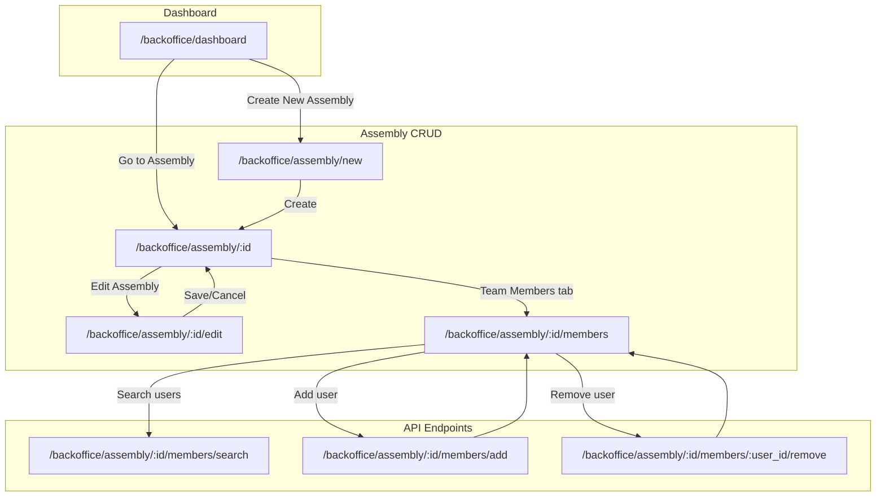
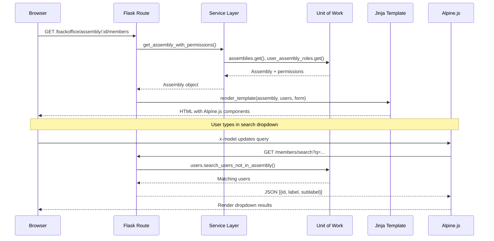
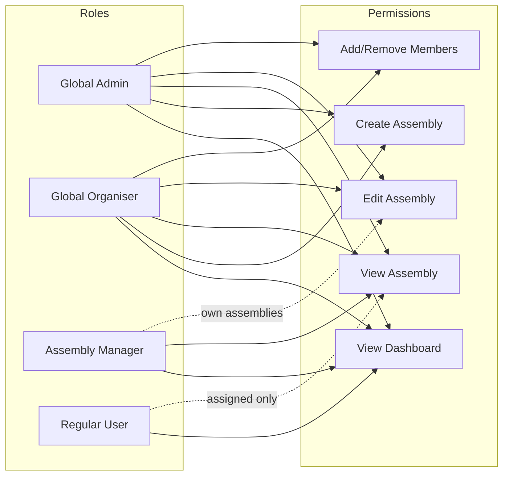
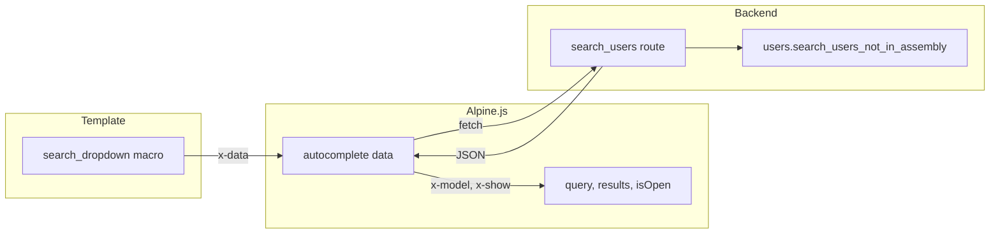

# Backoffice Assembly Module

This document describes the Assembly management module in the backoffice UI. For component usage and design tokens, see [backoffice_design_system.md](backoffice_design_system.md).

## Overview

The Assembly module provides CRUD operations for Citizens' Assemblies through a modern UI built with Tailwind CSS, Alpine.js, and Jinja2 templates.

## Route Map



## Page Hierarchy

| Page | Route | Template | Purpose |
|------|-------|----------|---------|
| Dashboard | `/backoffice/dashboard` | `dashboard.html` | List user's assemblies |
| Create Assembly | `/backoffice/assembly/new` | `create_assembly.html` | New assembly form |
| Assembly Details | `/backoffice/assembly/:id` | `assembly_details.html` | View assembly info |
| Edit Assembly | `/backoffice/assembly/:id/edit` | `edit_assembly.html` | Edit assembly form |
| Team Members | `/backoffice/assembly/:id/members` | `assembly_members.html` | Manage team members |

## Data Flow



## Access Control



| Role | Dashboard | Create | View | Edit | Manage Members |
|------|-----------|--------|------|------|----------------|
| Global Admin | ✅ All | ✅ | ✅ All | ✅ All | ✅ |
| Global Organiser | ✅ All | ✅ | ✅ All | ✅ All | ✅ |
| Assembly Manager | ✅ Assigned | ❌ | ✅ Assigned | ✅ Assigned | ❌ |
| Regular User | ✅ Assigned | ❌ | ✅ Assigned | ❌ | ❌ |

**Key rules:**
- Users only see assemblies they're assigned to (unless admin/organiser)
- Only global admins can add/remove team members
- Unauthorized access redirects to dashboard with flash message

## Tab Navigation

Assembly pages use inline tab navigation for switching between sections:

```
┌─────────────────────────────────────────────────────────┐
│  Details    │  Data & Selection  │  Team Members       │
├─────────────┴────────────────────┴─────────────────────┤
│                                                         │
│  Page content for selected tab                          │
│                                                         │
└─────────────────────────────────────────────────────────┘
```

**Implementation:** Tabs are simple anchor links to separate routes (not JavaScript tabs). The active tab is highlighted based on the current URL.

```jinja
{# In assembly_details.html and assembly_members.html #}
<nav aria-label="Assembly sections">
  <a href="{{ url_for('backoffice.view_assembly', assembly_id=assembly.id) }}"
     style="border-bottom: 2px solid var(--color-primary-action);">
    Details
  </a>
  <a href="{{ url_for('backoffice.view_assembly_members', assembly_id=assembly.id) }}"
     style="border-bottom: 2px solid var(--color-primary-action);">
    Team Members
  </a>
</nav>
```

## Alpine.js Patterns

### Autocomplete Search Dropdown

The team members page uses an Alpine.js autocomplete component for searching users. This pattern separates concerns:

| Layer | File | Responsibility |
|-------|------|----------------|
| Logic | `static/backoffice/js/alpine-components.js` | Reusable `autocomplete` data component |
| Presentation | `templates/backoffice/components/search_dropdown.html` | Jinja macro wrapping the Alpine component |
| API | `routes.py` → `search_users()` | JSON endpoint returning `[{id, label, sublabel}]` |



**Usage:**

```jinja


{{ search_dropdown(
    name="user_id",
    label="Select User",
    fetch_url=url_for('backoffice.search_users', assembly_id=assembly.id),
    placeholder="Type to search...",
    hint="Search by email or name"
) }}
```

**Component options:**

| Parameter | Default | Description |
|-----------|---------|-------------|
| `name` | required | Hidden input name for form submission |
| `fetch_url` | required | URL returning JSON array |
| `min_chars` | 2 | Minimum characters before searching |
| `debounce_ms` | 300 | Debounce delay in milliseconds |
| `param_name` | "q" | Query parameter name |

See [backoffice_design_system.md](backoffice_design_system.md) for general component documentation.

## Key Files

| Purpose | Path |
|---------|------|
| Routes | `src/opendlp/entrypoints/backoffice/routes.py` |
| Templates | `templates/backoffice/` |
| Alpine components | `static/backoffice/js/alpine-components.js` |
| Forms | `src/opendlp/entrypoints/forms.py` |
| Services | `src/opendlp/service_layer/assembly_service.py` |
| Permissions | `src/opendlp/service_layer/permissions.py` |

## Testing

BDD tests cover the assembly module in `tests/bdd/test_backoffice.py`:

- Dashboard displays assemblies
- Assembly CRUD operations
- Tab navigation
- Role-based access control (admin vs member)
- Search dropdown functionality

Run tests:
```bash
uv run pytest tests/bdd/test_backoffice.py -v
```
