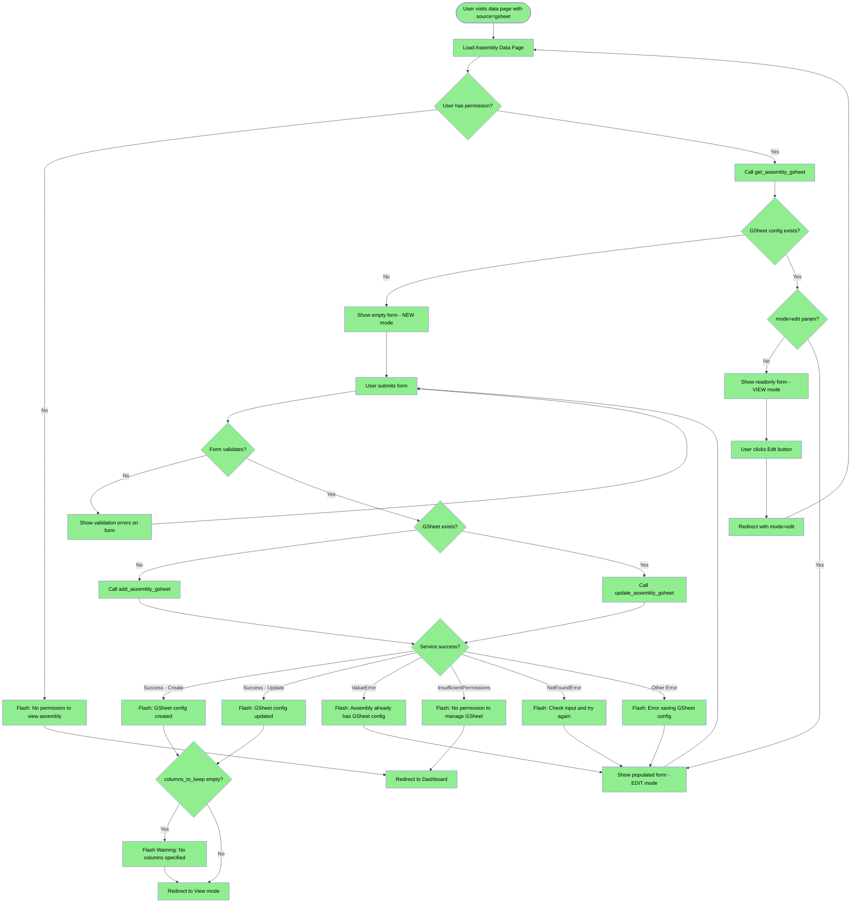
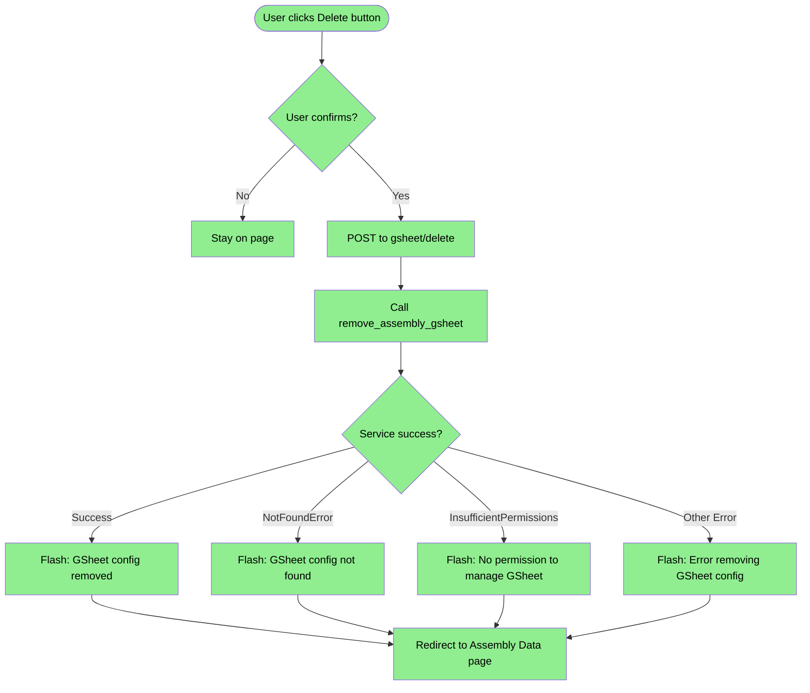

# Google Sheet Configuration Flow Specification

**Branch:** `csv-upload-and-gsheet-flow-redesign`
**Last Updated:** 2026-02-25

## Overview

This document specifies the Google Sheet configuration flow for the new backoffice UI. The goal is to replicate and improve upon the existing GOV.UK-style flow at `/assemblies/<assembly_id>/gsheet` in the new backoffice design system.

## Implementation Progress Legend

| Symbol | Meaning |
|--------|---------|
| ✅ | Implemented and tested |
| 🔄 | In progress |
| ⬜ | Not yet implemented |

In flowcharts: **Green nodes** = implemented, **White nodes** = not yet implemented

## TODO

- ✅ Add view mode with edit button
- ✅ Add form integration for CSRF and validation (backoffice)
- ✅ Update `save_gsheet_config` route with full service layer integration
- ✅ Add tests for save functionality
- ✅ Implement delete gsheet configuration

---

## Existing Flow Analysis

### Entry Points

The existing implementation lives in `src/opendlp/entrypoints/blueprints/gsheets.py`:

| Route | Method | Function | Purpose |
|-------|--------|----------|---------|
| `/assemblies/<id>/gsheet` | GET/POST | `manage_assembly_gsheet` | Create or edit gsheet config |
| `/assemblies/<id>/gsheet/delete` | POST | `delete_assembly_gsheet` | Remove gsheet config |

### Service Layer Functions

Located in `src/opendlp/service_layer/assembly_service.py`:

| Function | Purpose | Returns | Errors |
|----------|---------|---------|--------|
| `get_assembly_gsheet` | Retrieve existing config | `AssemblyGSheet \| None` | `UserNotFoundError`, `AssemblyNotFoundError`, `InsufficientPermissions` |
| `add_assembly_gsheet` | Create new config | `AssemblyGSheet` | `UserNotFoundError`, `AssemblyNotFoundError`, `InsufficientPermissions`, `ValueError` (if already exists) |
| `update_assembly_gsheet` | Update existing config | `AssemblyGSheet` | `UserNotFoundError`, `AssemblyNotFoundError`, `GoogleSheetConfigNotFoundError`, `InsufficientPermissions` |
| `remove_assembly_gsheet` | Delete config | `None` | `UserNotFoundError`, `AssemblyNotFoundError`, `GoogleSheetConfigNotFoundError`, `InsufficientPermissions` |

### Forms

Located in `src/opendlp/entrypoints/forms.py`:

- `AssemblyGSheetForm` - Base form with all fields
- `CreateAssemblyGSheetForm` - For creating (inherits base)
- `EditAssemblyGSheetForm` - For editing (inherits base)

**Form Fields:**
- `url` - Google Spreadsheet URL (required, validated)
- `team` - Team preset (uk, eu, aus, other)
- `select_registrants_tab` - Tab name for initial selection respondents
- `select_targets_tab` - Tab name for initial selection categories
- `replace_registrants_tab` - Tab name for replacement respondents
- `replace_targets_tab` - Tab name for replacement categories
- `already_selected_tab` - Tab name for already selected (for exclusion)
- `id_column` - Column name for participant ID
- `check_same_address` - Boolean flag
- `check_same_address_cols_string` - Comma-separated address column names
- `generate_remaining_tab` - Boolean flag
- `columns_to_keep_string` - Comma-separated column names to keep in output

**Cross-field Validation:**
- If `check_same_address` is True, `check_same_address_cols_string` must be non-empty

---

## Flow Diagrams

### Create/Edit GSheet Configuration Flow



### Delete GSheet Configuration Flow



---

## UI States

### Data Source Locking ✅

When a data source configuration exists (e.g., gsheet config), the data source selector is locked:

- ✅ Selector is disabled and shows locked message
- ✅ Data source auto-selects to the configured type (ignores query param)
- ✅ After deleting configuration, selector is unlocked
- ✅ Delete redirects without source param to show unlocked state

### 1. NEW Mode (No existing configuration) ✅

**Condition:** `gsheet_mode == "new"` (no gsheet config exists)

**URL:** `/backoffice/assembly/<id>/data?source=gsheet` (when no gsheet exists)

**UI Elements:**
- ✅ Page title: "Google Spreadsheet Configuration"
- ✅ Intro text: "Configure a Google Spreadsheet to import and manage participant data for this assembly."
- ✅ All form fields editable
- ✅ Submit button: "Save Configuration"
- ✅ No Cancel or Delete buttons
- ✅ Data source selector is enabled (unlocked)

### 2. VIEW Mode (Existing configuration, readonly) ✅

**Condition:** `gsheet_mode == "view"` (gsheet exists, no `mode=edit` param)

**URL:** `/backoffice/assembly/<id>/data?source=gsheet` (when gsheet exists)

**UI Elements:**
- ✅ Page title: "Google Spreadsheet Configuration"
- ✅ Edit button in header (links to `?source=gsheet&mode=edit`)
- ✅ All form fields readonly/disabled
- ✅ URL field shows as clickable link
- ✅ No Submit button
- ✅ Delete button (with confirmation)

### 3. EDIT Mode (Existing configuration, editable) ✅

**Condition:** `gsheet_mode == "edit"` (gsheet exists, `mode=edit` param)

**URL:** `/backoffice/assembly/<id>/data?source=gsheet&mode=edit`

**UI Elements:**
- ✅ Page title: "Google Spreadsheet Configuration"
- ✅ All form fields editable, pre-populated with existing values
- ✅ Submit button: "Save Configuration"
- ✅ Cancel button (links back to view mode)
- ✅ Delete button (with confirmation)

---

## Flash Messages Reference

### Success Messages

| Trigger | Message | Type |
|---------|---------|------|
| Create gsheet | "Google Spreadsheet configuration created successfully" | success |
| Update gsheet | "Google Spreadsheet configuration updated successfully" | success |
| Delete gsheet | "Google Spreadsheet configuration removed successfully" | success |

### Warning Messages

| Trigger | Message | Type |
|---------|---------|------|
| Empty columns_to_keep on save | "Warning: No columns to keep specified. This means the output will only include participant data columns used for the targets and address checking. Is this intentional?" | warning |

### Error Messages

| Trigger | Message | Type |
|---------|---------|------|
| Form validation fails | Field-specific errors shown inline | error |
| Cross-field validation (check_same_address without columns) | "You must specify address columns when 'Check Same Address' is enabled. Please enter column names or disable 'Check Same Address'." | error (inline) |
| InsufficientPermissions (view) | "You don't have permission to view this assembly" | error |
| InsufficientPermissions (manage) | "You don't have permission to manage Google Spreadsheet for this assembly" | error |
| NotFoundError (assembly) | "Assembly not found" | error |
| NotFoundError (gsheet on delete) | "Google Spreadsheet configuration not found" | error |
| NotFoundError (validation) | "Please check your input and try again" | error |
| ValueError (already exists) | Handled by form - redirects to edit | error |
| Generic error (save) | "An error occurred while saving the Google Spreadsheet configuration" | error |
| Generic error (delete) | "An error occurred while removing the Google Spreadsheet configuration" | error |
| Generic error (load page) | "An error occurred while loading assembly data" | error |

---

## Backoffice Implementation Plan

### Current State

- [x] Route `view_assembly_data` loads gsheet config via `get_assembly_gsheet`
- [x] Template displays form in NEW/VIEW/EDIT modes
- [x] Route `save_gsheet_config` fully implemented with service layer integration
- [x] Route `delete_gsheet_config` fully implemented with service layer integration

### Next Steps

1. **Add form imports to backoffice.py**
   ```python
   from opendlp.entrypoints.forms import CreateAssemblyGSheetForm, EditAssemblyGSheetForm
   ```

2. **Update `view_assembly_data` to pass form to template**
   - Create form instance based on mode (Create vs Edit)
   - Pre-populate form with existing gsheet data if editing

3. **Implement `save_gsheet_config` route**
   - Validate form
   - Call `add_assembly_gsheet` or `update_assembly_gsheet`
   - Handle all error cases with appropriate flash messages
   - Redirect to view mode on success

4. **Add `delete_gsheet_config` route**
   - Call `remove_assembly_gsheet`
   - Handle error cases
   - Redirect to data page

5. **Update template to use form**
   - Use `form.hidden_tag()` for CSRF
   - Display validation errors inline
   - Use form field values instead of direct gsheet access

---

## Testing Checklist

### Unit Tests (Service Layer)
- [x] `get_assembly_gsheet` - returns config or None
- [x] `add_assembly_gsheet` - creates new config
- [x] `update_assembly_gsheet` - updates existing config
- [x] `remove_assembly_gsheet` - deletes config
- [x] Permission checks for all operations

### E2E Tests (Backoffice Routes)

**Page Loading (Increment 1) ✅**
- [x] Load data page without source
- [x] Load data page with gsheet source (no config) - shows NEW mode
- [x] Load data page with gsheet source (with config) - shows VIEW mode
- [x] Load data page with gsheet source and mode=edit (with config) - shows EDIT mode
- [x] Load data page with csv source
- [x] Invalid source parameter ignored
- [x] Unauthenticated redirect to login
- [x] Non-existent assembly redirect

**Form Fields (Increment 1) ✅**
- [x] NEW mode form contains required fields (url, tabs, options)
- [x] VIEW mode shows Edit button and gsheet URL
- [x] EDIT mode form is editable with Save and Cancel buttons

**Form Submission (Increment 2) ✅**
- [x] Submit create form - success
- [x] Submit create form - validation error (missing URL)
- [x] Submit create form - validation error (invalid URL)
- [x] Submit edit form - success
- [x] Submit edit form - validation error
- [x] Warning shown for empty columns_to_keep
- [x] Form defaults shown in NEW mode (Respondents, Categories, Selected)

**Delete (Increment 3) ✅**
- [x] Delete config - success
- [x] Delete config - not found error
- [x] Delete button shown in VIEW mode
- [x] Delete button shown in EDIT mode
- [x] Delete button NOT shown in NEW mode

**Data Source Locking ✅**
- [x] Selector locked when config exists
- [x] Data source auto-selects when config exists
- [x] Selector unlocked when no config exists
- [x] Selector unlocked after delete
- [x] Gsheet option selected in dropdown when locked

**Permissions ⬜**
- [ ] Permission denied scenarios for view
- [ ] Permission denied scenarios for save
- [ ] Permission denied scenarios for delete
