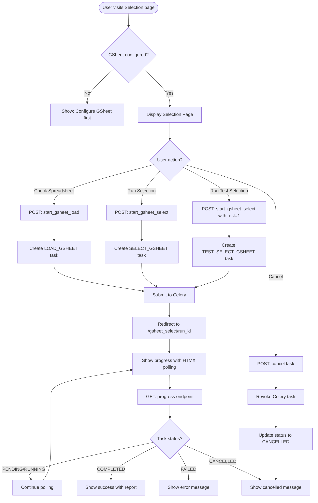
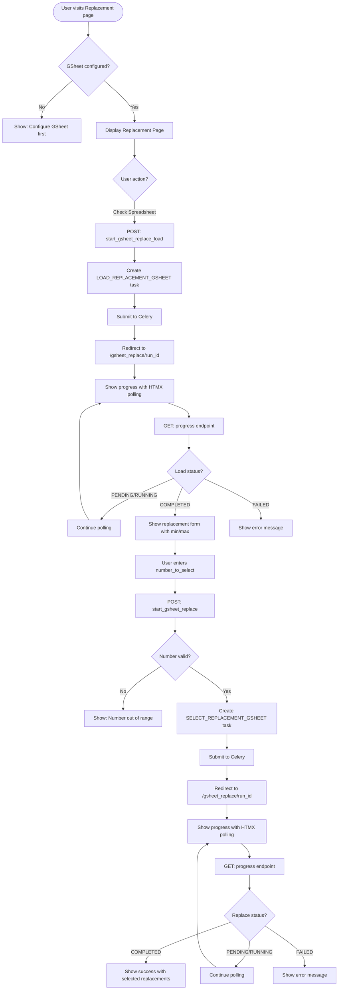
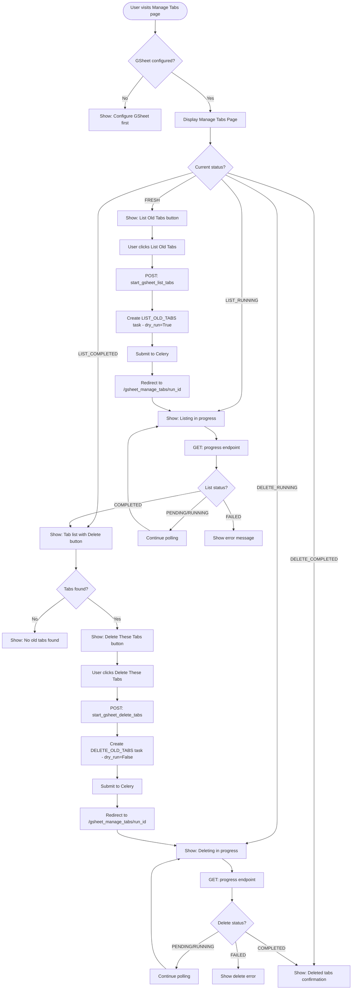

# Selection Tab Specification

**Branch:** `csv-upload-and-gsheet-flow-redesign`
**Last Updated:** 2026-02-25

## Overview

This document specifies the Selection tab functionality for the new backoffice UI. The Selection tab provides three core operations:

1. **Initial Selection** - Run sortition algorithm on initial participant data
2. **Replacement Selection** - Run sortition for replacement participants
3. **Manage Generated Tabs** - List and delete old output tabs in Google Sheets

In the old system, these are accessed via buttons on the data page (`/assemblies/<assembly_id>/data`). In the new backoffice, they will be under the "Selection" tab of the assembly data page.

## Implementation Progress Legend

| Symbol | Meaning |
|--------|---------|
| ✅ | Implemented and tested |
| 🔄 | In progress |
| ⬜ | Not yet implemented |

---

## Existing Flow Analysis

### Entry Points (Old System)

The existing implementation lives in `src/opendlp/entrypoints/blueprints/gsheets.py`:

#### Initial Selection Routes

| Route | Method | Function | Purpose |
|-------|--------|----------|---------|
| `/assemblies/<id>/gsheet_select` | GET | `select_assembly_gsheet` | Display selection page |
| `/assemblies/<id>/gsheet_select/<run_id>` | GET | `select_assembly_gsheet_with_run` | Display with task status |
| `/assemblies/<id>/gsheet_select/<run_id>/progress` | GET | `gsheet_select_progress` | HTMX polling endpoint |
| `/assemblies/<id>/gsheet_select` | POST | `start_gsheet_select` | Start selection task |
| `/assemblies/<id>/gsheet_load` | POST | `start_gsheet_load` | Validate spreadsheet data |
| `/assemblies/<id>/gsheet_select/<run_id>/cancel` | POST | `cancel_gsheet_select` | Cancel running task |

#### Replacement Selection Routes

| Route | Method | Function | Purpose |
|-------|--------|----------|---------|
| `/assemblies/<id>/gsheet_replace` | GET | `replace_assembly_gsheet` | Display replacement page |
| `/assemblies/<id>/gsheet_replace/<run_id>` | GET | `replace_assembly_gsheet_with_run` | Display with task status |
| `/assemblies/<id>/gsheet_replace/<run_id>/progress` | GET | `gsheet_replace_progress` | HTMX polling endpoint |
| `/assemblies/<id>/gsheet_replace_load` | POST | `start_gsheet_replace_load` | Validate replacement data |
| `/assemblies/<id>/gsheet_replace` | POST | `start_gsheet_replace` | Start replacement task |
| `/assemblies/<id>/gsheet_replace/<run_id>/cancel` | POST | `cancel_gsheet_replace` | Cancel running task |

#### Manage Generated Tabs Routes

| Route | Method | Function | Purpose |
|-------|--------|----------|---------|
| `/assemblies/<id>/gsheet_manage_tabs` | GET | `manage_assembly_gsheet_tabs` | Display tab management page |
| `/assemblies/<id>/gsheet_manage_tabs/<run_id>` | GET | `manage_assembly_gsheet_tabs_with_run` | Display with task results |
| `/assemblies/<id>/gsheet_manage_tabs/<run_id>/progress` | GET | `gsheet_manage_tabs_progress` | HTMX polling endpoint |
| `/assemblies/<id>/gsheet_list_tabs` | POST | `start_gsheet_list_tabs` | List old tabs (dry run) |
| `/assemblies/<id>/gsheet_delete_tabs` | POST | `start_gsheet_delete_tabs` | Delete old tabs |
| `/assemblies/<id>/gsheet_manage_tabs/<run_id>/cancel` | POST | `cancel_gsheet_manage_tabs` | Cancel running task |

---

### Service Layer Functions

Located in `src/opendlp/service_layer/sortition.py`:

#### Task Initiation Functions

| Function | Purpose | Task Type | Celery Task |
|----------|---------|-----------|-------------|
| `start_gsheet_load_task()` | Validate selection data | `LOAD_GSHEET` | `tasks.load_gsheet` |
| `start_gsheet_select_task()` | Run initial selection | `SELECT_GSHEET` or `TEST_SELECT_GSHEET` | `tasks.run_select` |
| `start_gsheet_replace_load_task()` | Validate replacement data | `LOAD_REPLACEMENT_GSHEET` | `tasks.load_gsheet` |
| `start_gsheet_replace_task()` | Run replacement selection | `SELECT_REPLACEMENT_GSHEET` | `tasks.run_select` |
| `start_gsheet_manage_tabs_task()` | List or delete old tabs | `LIST_OLD_TABS` or `DELETE_OLD_TABS` | `tasks.manage_old_tabs` |

#### Status and Monitoring Functions

| Function | Purpose |
|----------|---------|
| `get_selection_run_status()` | Get current task status with logs and report |
| `check_and_update_task_health()` | Monitor task health, mark dead tasks as failed |
| `cancel_task()` | Cancel running/pending task |
| `get_manage_old_tabs_status()` | Convert result to tab management status enum |
| `get_latest_run_for_assembly()` | Get most recent run for an assembly |

---

### Task Types

```
LOAD_GSHEET              - Validate initial selection data
SELECT_GSHEET            - Run initial selection (actual)
TEST_SELECT_GSHEET       - Run initial selection (test mode)
LOAD_REPLACEMENT_GSHEET  - Validate replacement data
SELECT_REPLACEMENT_GSHEET - Run replacement selection
LIST_OLD_TABS            - List old tabs (dry run)
DELETE_OLD_TABS          - Delete old tabs (actual)
```

### Task Statuses

```
PENDING    - Task created, waiting to start
RUNNING    - Task is executing
COMPLETED  - Task finished successfully
FAILED     - Task finished with error
CANCELLED  - Task was cancelled by user
```

---

## Flow Diagrams

### Initial Selection Flow



### Replacement Selection Flow



### Manage Generated Tabs Flow



---

## Data Models

### SelectionRunRecord

Tracks all task execution:

| Field | Type | Description |
|-------|------|-------------|
| `id` | UUID | Primary key |
| `task_id` | UUID | Task identifier |
| `assembly_id` | UUID | Assembly running the task |
| `task_type` | Enum | Type of task (see Task Types) |
| `status` | Enum | Current status (see Task Statuses) |
| `celery_task_id` | String | Celery task ID |
| `log_messages` | JSON | List of log messages from execution |
| `run_report` | JSON | Detailed report from sortition algorithms |
| `settings_used` | JSON | GSheet settings used for this run |
| `user_id` | UUID | User who initiated the task |
| `created_at` | DateTime | When task was created |
| `completed_at` | DateTime | When task finished (if applicable) |
| `error_message` | String | User-facing error message (if failed) |

### Result Types

| Type | Fields | Used For |
|------|--------|----------|
| `RunResult` | run_record, run_report, log_messages, success | Base result |
| `LoadRunResult` | + features, people | Load/validation tasks |
| `SelectionRunResult` | + selected_ids | Selection tasks |
| `TabManagementResult` | + tab_names | Tab management tasks |

### ManageOldTabsStatus Enum

```
FRESH            - No recent tab management task
LIST_RUNNING     - Listing tabs in progress
LIST_COMPLETED   - Tab listing complete
DELETE_RUNNING   - Deleting tabs in progress
DELETE_COMPLETED - Tab deletion complete
ERROR            - Task failed
```

---

## Error Messages

### Selection Errors

| Trigger | Message |
|---------|---------|
| No gsheet configured | "Please configure a Google Spreadsheet first" |
| Spreadsheet not found | "Could not access the spreadsheet. Please check the URL and permissions." |
| Missing required tab | "Required tab '%(tab)s' not found in spreadsheet" |
| Missing required column | "Required column '%(column)s' not found in tab '%(tab)s'" |
| No participants found | "No valid participants found in the spreadsheet" |
| Task timeout | "Task timed out after %(hours)s hours" |
| Task cancelled | "Task was cancelled" |
| Celery connection error | "Could not connect to task queue" |

### Replacement Errors

| Trigger | Message |
|---------|---------|
| Number out of range | "Number to select must be between %(min)s and %(max)s" |
| No remaining participants | "No remaining participants found for replacement" |
| Already selected tab missing | "Already selected tab '%(tab)s' not found" |

### Tab Management Errors

| Trigger | Message |
|---------|---------|
| Cannot list tabs | "Could not list tabs in spreadsheet" |
| Cannot delete tabs | "Could not delete tabs: %(error)s" |
| No tabs to delete | "No old tabs found to delete" |

---

## UI Components (New Design)

### Selection Section

**When no task is running:**
- Card header: "Initial Selection"
- Description text explaining the selection process
- Info box: "Number to select: X" (from assembly config)
- Buttons:
  - Primary: "Run Selection"
  - Secondary: "Run Test Selection"
  - Outline: "Check Spreadsheet"
- Link: "Manage Generated Tabs"

**When task is running:**
- Progress indicator with status
- Log messages display
- Cancel button (danger variant)

**When task completed:**
- Success/Error alert
- Report summary
- Link to view full report

### Replacement Section

**Initial state:**
- Card header: "Replacement Selection"
- Description text
- Button: "Check Spreadsheet" (loads and validates data)

**After validation (data loaded):**
- Success message showing min/max available
- Form field: "Number to select" (number input with validation)
- Button: "Run Replacements"

**When task is running:**
- Progress indicator
- Log messages
- Cancel button

### Manage Tabs Section

**Fresh state:**
- Card header: "Manage Generated Tabs"
- Description explaining what old tabs are
- Button: "List Old Tabs"

**After listing:**
- List of found tabs (if any)
- Button: "Delete These Tabs" (if tabs found)
- Button: "Refresh List"

**After deletion:**
- Confirmation message
- List of deleted tabs
- Button: "List Old Tabs" (to check again)

---

## New Backoffice Routes

For the new backoffice implementation, the routes will be under `/backoffice/assembly/<id>/`:

| Route | Method | Purpose |
|-------|--------|---------|
| `/backoffice/assembly/<id>/selection` | GET | Selection tab page |
| `/backoffice/assembly/<id>/selection/load` | POST | Validate selection data |
| `/backoffice/assembly/<id>/selection/run` | POST | Run selection |
| `/backoffice/assembly/<id>/selection/<run_id>` | GET | Selection with run status |
| `/backoffice/assembly/<id>/selection/<run_id>/progress` | GET | HTMX progress polling |
| `/backoffice/assembly/<id>/selection/<run_id>/cancel` | POST | Cancel task |
| `/backoffice/assembly/<id>/replacement` | GET | Replacement page |
| `/backoffice/assembly/<id>/replacement/load` | POST | Validate replacement data |
| `/backoffice/assembly/<id>/replacement/run` | POST | Run replacement |
| `/backoffice/assembly/<id>/replacement/<run_id>` | GET | Replacement with run status |
| `/backoffice/assembly/<id>/replacement/<run_id>/progress` | GET | HTMX progress polling |
| `/backoffice/assembly/<id>/replacement/<run_id>/cancel` | POST | Cancel task |
| `/backoffice/assembly/<id>/manage-tabs` | GET | Manage tabs page |
| `/backoffice/assembly/<id>/manage-tabs/list` | POST | List old tabs |
| `/backoffice/assembly/<id>/manage-tabs/delete` | POST | Delete old tabs |
| `/backoffice/assembly/<id>/manage-tabs/<run_id>` | GET | Manage tabs with run status |
| `/backoffice/assembly/<id>/manage-tabs/<run_id>/progress` | GET | HTMX progress polling |
| `/backoffice/assembly/<id>/manage-tabs/<run_id>/cancel` | POST | Cancel task |

---

## Implementation Plan

### Phase 1: Selection Tab - Basic Structure ⬜

1. Add "Selection" tab to assembly data page navigation
2. Create selection page template with three sections
3. Implement basic routes (without task functionality)

### Phase 2: Initial Selection ⬜

1. Implement `view_selection` route
2. Implement `start_selection_load` route
3. Implement `start_selection_run` route
4. Add HTMX progress polling
5. Add cancel functionality
6. Add tests

### Phase 3: Replacement Selection ⬜

1. Implement `view_replacement` route
2. Implement `start_replacement_load` route
3. Implement `start_replacement_run` route with form
4. Add HTMX progress polling
5. Add cancel functionality
6. Add tests

### Phase 4: Manage Generated Tabs ⬜

1. Implement `view_manage_tabs` route
2. Implement `start_list_tabs` route
3. Implement `start_delete_tabs` route
4. Add HTMX progress polling
5. Add cancel functionality
6. Add tests

### Phase 5: Selection History ⬜

1. Add selection run history table
2. Add pagination
3. Add view run details page
4. Add tests

---

## Testing Checklist

### Unit Tests (Service Layer)
- [ ] `start_gsheet_load_task` creates correct task
- [ ] `start_gsheet_select_task` creates selection task
- [ ] `start_gsheet_select_task` with test=True creates test task
- [ ] `start_gsheet_replace_load_task` creates correct task
- [ ] `start_gsheet_replace_task` validates number range
- [ ] `start_gsheet_manage_tabs_task` with dry_run=True creates list task
- [ ] `start_gsheet_manage_tabs_task` with dry_run=False creates delete task
- [ ] `get_selection_run_status` returns correct status
- [ ] `cancel_task` revokes and updates status
- [ ] `check_and_update_task_health` marks dead tasks as failed

### E2E Tests (Backoffice Routes)

**Selection Page ⬜**
- [ ] Page loads with gsheet configured
- [ ] Page shows error when no gsheet configured
- [ ] Check Spreadsheet starts load task
- [ ] Run Selection starts select task
- [ ] Run Test Selection starts test select task
- [ ] Progress polling works
- [ ] Cancel task works
- [ ] Success state displays report
- [ ] Error state displays message

**Replacement Page ⬜**
- [ ] Page loads with gsheet configured
- [ ] Check Spreadsheet starts load task
- [ ] Form shows after successful load
- [ ] Form validates number range
- [ ] Run Replacement starts task
- [ ] Progress polling works
- [ ] Cancel task works

**Manage Tabs Page ⬜**
- [ ] Page loads with gsheet configured
- [ ] List Old Tabs starts list task
- [ ] Delete buttons shown when tabs found
- [ ] Delete tabs starts delete task
- [ ] Progress polling works
- [ ] Cancel task works

**Permissions ⬜**
- [ ] Unauthorized users cannot access selection pages
- [ ] Unauthorized users cannot start tasks
- [ ] Unauthorized users cannot cancel tasks
