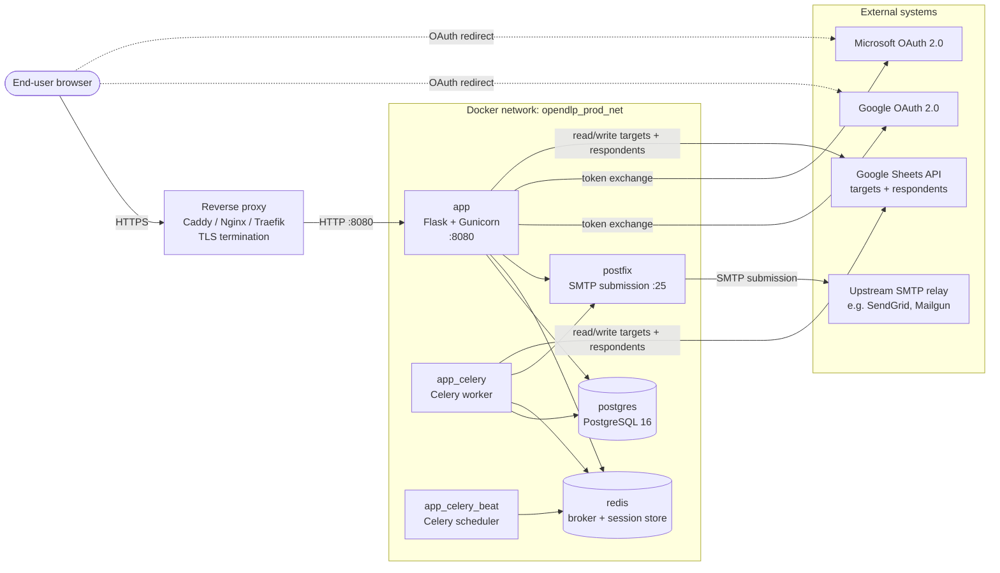

# OpenDLP System Architecture

This document describes the **deployed system** — the containers, data stores, and external services that make up a running OpenDLP instance — and how they are connected.

For the internal architecture of the Python application (domain, service layer, adapters, blueprints) see [architecture.md](architecture.md).

## Table of Contents

- [Deployment Topology](#deployment-topology)
- [Containers](#containers)
- [Data Stores](#data-stores)
- [External Systems](#external-systems)
- [Networking](#networking)
- [Configuration and Secrets](#configuration-and-secrets)
- [Further Reading](#further-reading)

---

## Deployment Topology

The canonical production layout is defined in [`compose.production.yaml`](../compose.production.yaml). All application containers run the same image (`hamishsortition/opendlp:latest`) with different entrypoints, and share a dedicated Docker network (`opendlp_prod_net`).

A reverse proxy (Caddy, Nginx, Traefik, …) sits in front of the app container to terminate TLS and forward HTTP to port 8080. The proxy is out of scope for the compose file itself; see [deploy.md](deploy.md) for configuration examples.

---

## Containers

All three application containers run the same Docker image; only the entrypoint and command differ. Resource limits and OOM priorities are set as overrides; the values below are the defaults documented in `compose.production.yaml`.

| Service | Image | Role | Listens on | OOM priority |
| --- | --- | --- | --- | --- |
| `app` | `hamishsortition/opendlp:latest` | Flask web app via Gunicorn (entrypoint `/app/bin/gunicorn`). Handles HTTP requests. | `:8080` (published to host) | `-500` (medium protection) |
| `app_celery` | same | Celery worker (`celery ... worker`). Runs background selections, GSheet I/O, email sends, cleanup tasks. | — (outbound only) | `+500` (killed first under pressure — selections can be restarted) |
| `app_celery_beat` | same | Celery beat scheduler. Enqueues periodic jobs (orphaned-task cleanup, token cleanup). | — | `-200` (mild protection) |
| `postgres` | `postgres:16` | Primary datastore. Single instance, volume-backed. | `:5432` (cluster-internal) | `-900` (almost never killed) |
| `redis` | `redis:alpine` | Celery broker and result backend, plus Flask session store (`flask-session`). `allkeys-lru` eviction, 450 MB cap. | `:6379` (cluster-internal) | `-800` (high protection) |
| `postfix` | `boky/postfix:latest` | Local SMTP submission endpoint. Accepts mail from the app/worker on port 25 and relays onward to the configured upstream relay. | `:25` (cluster-internal) | `-500` |

### Worker runtime

The worker runs with `--concurrency=2`, `--max-memory-per-child=5000000` (KiB ≈ 5 GB) and `--max-tasks-per-child=50`. Selection runs are memory-hungry; the positive `oom_score_adj` on the worker is deliberate so that the kernel sheds the worker before the web app or database under pressure.

### Alternate topology: external PostgreSQL

`compose.production-nodb.yaml` drops the `postgres` service and points the app at a Postgres instance running on the host (or elsewhere). Everything else is identical.

---

## Data Stores

| Store | Purpose | Persistence |
| --- | --- | --- |
| PostgreSQL (`postgres`) | All domain data: users, invites, assemblies, targets, respondents, selection run records, OAuth identities. Schema managed by Alembic. | Docker named volume `sqla_opendlp_prod_pgdata`. |
| Redis (`redis`) | Flask session store (server-side sessions keyed by cookie), Celery broker, Celery result backend, rate-limit counters. | Ephemeral by design — `allkeys-lru` with 450 MB cap. Sessions and queued tasks are lost on restart. |

Short-lived data such as generated CSV / Excel exports is held in memory, embedded into HTML responses, or served from a scratch directory that is pruned regularly — see the GDPR section in [AGENTS.md / CLAUDE.md](../AGENTS.md) for the rationale.

---

## External Systems

Everything in this section lives outside the compose network and is reached over the public internet.

| System | Used by | Purpose | Configured via |
| --- | --- | --- | --- |
| Reverse proxy (Caddy / Nginx / Traefik) | End users → `app` | TLS termination, virtual host routing, `X-Forwarded-*` headers. | Operator-managed; see [deploy.md](deploy.md). |
| Google OAuth 2.0 | `app` (and user browser for redirects) | Sign-in with Google. | `OAUTH_GOOGLE_CLIENT_ID`, `OAUTH_GOOGLE_CLIENT_SECRET`. See [google_oauth_setup.md](google_oauth_setup.md). |
| Microsoft OAuth 2.0 | `app` (and user browser) | Sign-in with Microsoft. Secret expiry is surfaced by the health check. | `OAUTH_MICROSOFT_CLIENT_ID`, `OAUTH_MICROSOFT_CLIENT_SECRET`, `OAUTH_MICROSOFT_CLIENT_SECRET_EXPIRY`. See [microsoft_oauth_setup.md](microsoft_oauth_setup.md). |
| Google Sheets API | `app` and `app_celery` | Reading and writing **targets and respondent data** for assemblies configured to use a Google Sheet as their data source. Selection runs pull respondents from the sheet and write results back to new tabs. Authenticated as a **Google service account** (not as the end user), so the sheet must be shared with the service account's email address. | Service-account JSON credentials mounted into the container; path given by `GOOGLE_AUTH_JSON_PATH`. See [google_service_account.md](google_service_account.md). |
| Upstream SMTP relay (e.g. SendGrid, Mailgun, hosting provider) | `postfix` | Final delivery of outbound email (invites, password resets, email confirmations, notifications). | `RELAYHOST`, `RELAYHOST_USERNAME`, `RELAYHOST_PASSWORD`, `ALLOWED_SENDER_DOMAINS`, `MASQUERADE_DOMAINS`. See [postfix_configuration.md](postfix_configuration.md). |

Not all of these are required. A deployment that does not use Google Sheets, one of the OAuth providers, or the postfix relay can leave the corresponding settings blank; the app exposes only the features whose configuration is present.

---

## Networking

- All application containers share the `opendlp_prod_net` bridge network and reach each other by service name (`postgres`, `redis`, `postfix`).
- Only the `app` container publishes a port to the host (`8080:8080`). Everything else is cluster-internal.
- The reverse proxy terminates HTTPS and forwards to `localhost:8080`, sending `X-Forwarded-Host`, `X-Forwarded-Proto`, and `X-Forwarded-For`. `ProxyFix` in the Flask app trusts these for URL generation. See [deploy.md](deploy.md#reverse-proxy-configuration).
- Outbound connections to OAuth providers, Google Sheets, and the upstream SMTP relay follow the host's egress rules.
- The app container has a readiness healthcheck (`curl --fail http://localhost:8080`); the Celery worker uses `celery inspect ping`; postgres uses `pg_isready`; redis uses `redis-cli ping`. Compose `depends_on: condition: service_healthy` chains ensure the app only starts once the data stores and relay are ready.

---

## Configuration and Secrets

Configuration is layered via two env files loaded into each container:

- `.env` — shared defaults (DB name/user/host, non-sensitive flags).
- `.env.prod` — deployment-specific secrets (DB password, `SECRET_KEY`, OAuth client secrets, `TOTP_ENCRYPTION_KEY`, SMTP relay credentials, Google service-account path).

Neither file is committed. See [env.example](../env.example) for the full variable list and [configuration.md](configuration.md) for semantics.

The Google service-account JSON is mounted into the container filesystem; its path is given by `GOOGLE_AUTH_JSON_PATH`.

---

## Further Reading

- [Flask/DDD internal architecture](architecture.md) — the counterpart to this document, describing code-level layout.
- [Docker Setup](docker.md) — compose file variants, commands, dev vs prod.
- [Deployment Guide](deploy.md) — reverse proxy, subpath deployment, Alembic migrations.
- [Background Tasks](background_tasks.md) — Celery task inventory and monitoring.
- [Postfix Email Configuration](postfix_configuration.md) — SMTP relay setup.
- [Google OAuth setup](google_oauth_setup.md) / [Microsoft OAuth setup](microsoft_oauth_setup.md) / [Google service account setup](google_service_account.md) — external-system credentials.
- [Configuration Guide](configuration.md) — environment variable reference.
